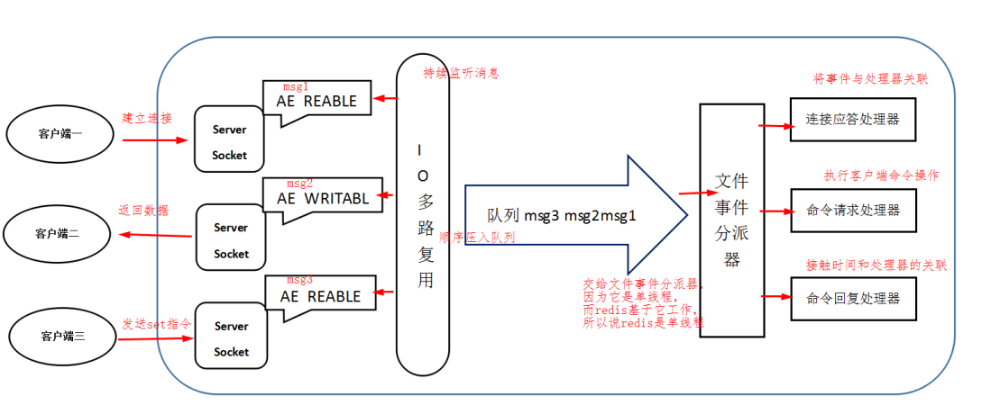

## 概述

随着发展，传统的关系型数据库承受不了大流量的高并发读写，现在一般使用 `缓存 + 分库分表` 的技术减轻单机存储的压力。

NoSQL:：Not Only SQL：不仅仅是SQL，泛指非关系型数据库。NoSQL 数据库是为了极致的性能产生的，所以和传统 RDBMS 有一定区别：

- 没有固定的查询语言
- 多种分类：键值对存储，列存储，文档存储，图数据库，....
- 一般来说没有事务的存在，对于数据仅仅会保证最终一致性
- 高性能，高可用，高可扩

**Redis 概述**

Redis：Remote Dictionary Server：远程字典服务。免费、开源，C 语言写的。支持网络，可基于内存和持久化的日志型，kv 的数据库，并支持多种语言。

效率很高，官方号称一秒读 11w，写 8w。

因为是效率第一，所以使用内存存储，所以一般用于做缓存，也可以利用其中的结构做一些消息队列、发布订阅等功能。

特别重要的数据不要放到 Redis 中，即使有 RDB、AOF 等持久化技术，内存为主也决定了数据有可能不安全。但是放一些经常查询、不常修改的数据是可以的。

**学习网址**

- [官网](https://redis.io/)
- [在线测试](https://try.redis.io/)

**单线程的 Redis**

事实上，单线程所指的是 Redis 核心模块，而不是说 Redis 整个实例是一个线程。

Redis 共有四个模块：多个套接字、IO 多路复用程序、文件事件分派器、事件处理器。



我们说的单线程，其实说的是文件事件分派器是单线程的。

**Redis 的高效来源**

1. Redis 完全基于内存，大部分是纯内存操作，所以速度快。
1. 虽然是单线程的，但是也没有 CPU 上下文切换带来的开销。事实上，Redis 完全没有必要去考虑多线程。
1. 数据结构比较简单，是专门设计过的。
1. 不用去考虑各种锁的问题。
1. 使用 IO 多路复用模型，而不是阻塞 IO。

    IO 多路复用，事件驱动。阻塞 IO 的模型是，CPU 主动去挨个处理某个 IO 的内容，只要没处理完就停在那里。

    但是 IO 多路复用是谁有内容通知 CPU，CPU 再去处理，这也就是事件驱动。所谓的 reactor 模式。

1. Redis 自己构建了 VM 机制，底层模型实现方式、客户端之间通信不同。

**数据库**

Redis 中的数据库默认有 16 个，默认使用第 0 号数据库。可以使用 `SELECT` 切换数据库，也可以使用 `DBSIZE` 查看大小。

使用 `keys *` 查看所有的 key，使用 `get` 查看 k 对应的值。

使用 `flushdb` 清空选中的数据库，使用 `flushAll` 清空所有数据库。

## 数据结构

**key 的操作**

在介绍 Redis 的数据结构之前，首先要介绍 key 的操作，无论是那种数据类型，都是需要有 key 的，而数据类型是说的 value。

```shell
# --------------------------------------------------------------------------------------
127.0.0.1:6379> set name howling	# 设置key-value
OK

127.0.0.1:6379> keys *				# 查看当前所有的key
1) "name"
127.0.0.1:6379> get name
"howling"

127.0.0.1:6379> exists name			# 存在断言
(integer) 1
127.0.0.1:6379> move name 1			# 移动数据到指定的数据库
(integer) 1
127.0.0.1:6379> select 1			# 切换到数据库1
OK
127.0.0.1:6379[1]> keys *
1) "name"

127.0.0.1:6379[1]> expire name 10	# 设置过期时间
(integer) 1
127.0.0.1:6379[1]> ttl name			# 查看当前剩余时间
(integer) 7
# --------------------------------------------------------------------------------------
127.0.0.1:6379[1]> ttl name
(integer) 1
127.0.0.1:6379[1]> ttl name
(integer) -2
127.0.0.1:6379[1]> keys *
(empty array)
127.0.0.1:6379[1]> select 0
OK
127.0.0.1:6379> keys *
(empty array)
127.0.0.1:6379> set name howling
OK
# --------------------------------------------------------------------------------------

127.0.0.1:6379> type name			# 查看当前数据的类型
string
```

### 五大基本类型

**String**

```shell
# --------------------------------------------------------------------------------------
127.0.0.1:6379> set name howling	# 设置值
OK
127.0.0.1:6379> append name hello	# 追加值，如果这个key不存在，就相当于设置一个新值
(integer) 12
127.0.0.1:6379> get name			# 获取值
"howlinghello"
127.0.0.1:6379> strlen name 		# 获得字符串长度
(integer) 12
```

```shell
# --------------------------------------------------------------------------------------
127.0.0.1:6379> keys *
(empty array)
127.0.0.1:6379> set num 0
OK
127.0.0.1:6379> get num
"0"
# --------------------------------------------------------------------------------------
127.0.0.1:6379> incr num			# 值+1，num++
(integer) 1
127.0.0.1:6379> get num
"1"
127.0.0.1:6379> decr num			# 值 -1，num--
(integer) 0
127.0.0.1:6379> get num
"0"

127.0.0.1:6379> incrby num 10		# 设置步长，值增加，num+=10
(integer) 10
127.0.0.1:6379> get num
"10"
127.0.0.1:6379> decrby num 5		# 设置步长，值减少，num-=5
(integer) 5
# 只有数字才可以采用加减等操作
127.0.0.1:6379> get num
"5"
```

```shell
# --------------------------------------------------------------------------------------
127.0.0.1:6379> keys *
(empty array)
127.0.0.1:6379> set name howling
OK

127.0.0.1:6379> getrange name 0 2		# 截取字符串
"how"
127.0.0.1:6379> getrange name 0 -1		# 获取全部字符串，等同于 get name
"howling"

127.0.0.1:6379> setrange name 1 xx		# 从指定位置开始，每一个都替换字符串
(integer) 7
127.0.0.1:6379> get name
"hxxling"
```

```shell
# --------------------------------------------------------------------------------------
127.0.0.1:6379> keys *
(empty array)
127.0.0.1:6379> setex name 10 howling	# 假如数据存在，仍然设置，并设置过期时间为10秒，set with expire
OK
127.0.0.1:6379> get name
"howling"
127.0.0.1:6379> ttl name
(integer) -2
127.0.0.1:6379> get name
(nil)
```

```shell
# --------------------------------------------------------------------------------------
127.0.0.1:6379> set name howling
OK
127.0.0.1:6379> setnx name bean			# 假如不存在才设置，set if not exist
(integer) 0
127.0.0.1:6379> get name				# 数据仍然不变
"howling"
127.0.0.1:6379> setnx key bean			# 假如不存在才设置
(integer) 1
127.0.0.1:6379> get key					# 这就是数据不变则设置
"bean"
```

```shell
# --------------------------------------------------------------------------------------
127.0.0.1:6379> keys *
(empty array)
127.0.0.1:6379> mset k1 v1 k2 v2 k3 v3		# 批量添加
OK
127.0.0.1:6379> mget k1 k2 k3				# 批量获取
1) "v1"
2) "v2"
3) "v3"
```
```shell
# --------------------------------------------------------------------------------------
127.0.0.1:6379> msetnx k1 vv1 k4 v4			# 想要批量设置，假如不存在的话
(integer) 0
# msetnx 是一个原子性操作，要么同时成功，要么同时失败
127.0.0.1:6379> mget k1 k4					# k1没有改变，k4没有出现
1) "v1"
2) (nil)

127.0.0.1:6379> mset k4 v4 k5 v5			# 想要批量设置，假如不存在的话
OK
127.0.0.1:6379> mget k4 k5					# 出现了结果
1) "v4"
2) "v5"
```

```shell
# --------------------------------------------------------------------------------------
127.0.0.1:6379> set user:1:name howling		# 使用字符串进行一些骚操作
OK
127.0.0.1:6379> set user:1:age 12
OK
127.0.0.1:6379> mget user:1:name user:1:age
1) "howling"
2) "12"
```

```shell
# --------------------------------------------------------------------------------------
127.0.0.1:6379> keys *
(empty array)
127.0.0.1:6379> getset name bean		# 先get，后set
(nil)
# 这是一个组合命令
127.0.0.1:6379> get name
"bean"
127.0.0.1:6379> getset name howling
"bean"
127.0.0.1:6379> get name
"howling"
# --------------------------------------------------------------------------------------
```

**List**
