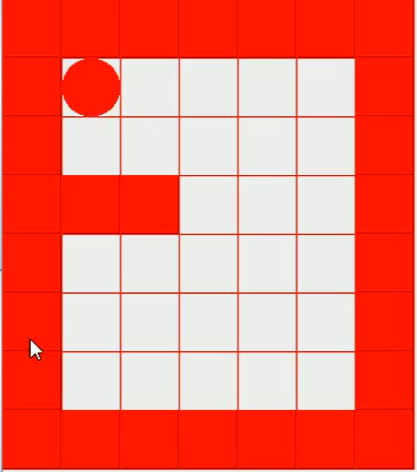

## 递归


递归，简单来讲就是方法自己调用自己，每次调用的时候传入的不同的变量。也就是俗称的套娃。递归有助于编程解决复杂的问题。

递归能够解决的问题：

- 各种数学问题：八皇后，汉诺塔，竭诚，迷宫，球和篮子。
- 各种算法：快速排序，归并排序，二分查找，分值算法。
- 将用栈解决的问题 --> 递归则比较简洁。

递归需要遵守的规则：

- 执行一个方法时，就会开辟一个独立的栈空间。
- 每个空间的数据（局部变量）是独立的，不会相互影响（引用类型变量会共享，比如数组）。
- 每次递归必须要向退出递归的条件逼近，否则会成为无限递归，导致 `StackOverflowError`。
- 当一个方法执行完毕或者遇到 `return`，就会退出。遵守谁调用，就将结果返回给谁的原则。

**最短路径案例**



```java
public static void main(String[] args) {
    // 我们创建一个 8 行 7 列的迷宫，其中四周，再加上两格为墙，具体就是我们的图片
    int[][] map = new int[8][7];


    // 模拟墙，首先第一行和最后一行全部置为 1，让 1 代表墙
    for (int i = 0; i < 7; i++) {
        map[0][i] = 1;
        map[7][i] = 1;
    }

    // 模拟墙，让第一列和最后一列全部置为 1
    for (int i = 0; i < 8; i++) {
        map[i][0] = 1;
        map[i][6] = 1;
    }

    // 第四行第二列和第四行第三列这两个格子也设置为墙
    map[3][1] = 1;
    map[3][2] = 1;

    System.out.println("------地图------");

    // 输出地图
    for (int i = 0; i < 8; i++) {
        for (int j = 0; j < 7; j++) {
            System.out.print(map[i][j] + "\t");
        }
        System.out.println();
    }

    // [0,0] 是墙不能走，所以走 [1,1]
    setWay(map, 1, 1);

    System.out.println("------走过道路的地图------");
    // 输出地图
    for (int i = 0; i < 8; i++) {
        for (int j = 0; j < 7; j++) {
            System.out.print(map[i][j] + "\t");
        }
        System.out.println();
    }
}
```

```java
/**
 * 使用递归回溯来给小球找路
 * 约定：当 map[i][j] 为 0 代表此路没有走过，1 表示墙，2 表示这条路可以走，3 表示该位置已经走过但是走不通
 * 我们走迷宫的策略是：先走下面，下面不通走右边，右边不通走上面，上面不通走左边：下-->右-->上-->左
 * 我们应该从 [1,1] 出发，走到 [6,5]
 *
 * @param map   地图
 * @param start 从哪个位置开始找，这就是当前小球的实时位置
 * @param end   从这个位置出发，要找的下一个位置
 * @return 如果找到通路，返回 true，如果路不通返回 false
 */
public static boolean setWay(int[][] map, int start, int end) {
    //假如已经到达了最终的目的地，那么就直接返回true，代表找到通路
    if (map[6][5] == 2) {
        return true;
    } else {
        //假如没有到达最终目的地，那么我们就开始找路了，假如这条路不为 0，那么要么为 2：走过去了，要么为 1：是墙不能走，要么为 3：是错误的路
        if (map[start][end] != 0) {
            return false;
        }
        //假如这个值为 0，说明是一条没有走过的路
        else {
            //首先我们假定从这个位置出发，是可以走路的
            map[start][end] = 2;
        /*
            下面开始走路试探:

            现在有 A、B、C 三个格子，A 将会走到 B 格子，B 格子将会走到 C 格子，我们现在处于 B 格子
            那么接下来我们要去寻找有没有 C 这个格子可以走，假如我们找到了 C 格子，就说明我们所在的 B 格子不是一条死路
            假如我们找不到可以通行的 C 格子，说明我们这个 B 格子就是一条死路
         */

            //首先向下走，假如返回来的结果是 true，说明从当前位置向下走确实可以走通，那么就告诉上一步：这个格子不是一条死路
            if (setWay(map, start + 1, end)) {
                return true;
            }
            //同样的道理，向下走走不通，我们可以试着向右走，如果能走通同样告诉上一步：这个格子不是一条死路
            else if (setWay(map, start, end + 1)) {
                return true;
            }
            //向上走
            else if (setWay(map, start - 1, end)) {
                return true;
            }
            //向下走
            else if (setWay(map, start, end - 1)) {
                return true;
            } else {
                //假如上下左右都走不通，那么我们这条路就是一条死路
                map[start][end] = 3;
                return false;
            }
        }
    }
}
```

```
------地图------
1	1	1	1	1	1	1
1	0	0	0	0	0	1
1	0	0	0	0	0	1
1	1	1	0	0	0	1
1	0	0	0	0	0	1
1	0	0	0	0	0	1
1	0	0	0	0	0	1
1	1	1	1	1	1	1
------走过道路的地图------
1	1	1	1	1	1	1
1	2	0	0	0	0	1
1	2	2	2	0	0	1
1	1	1	2	0	0	1
1	0	0	2	0	0	1
1	0	0	2	0	0	1
1	0	0	2	2	2	1
1	1	1	1	1	1	1
```

**八皇后问题案例**

在 8x8 格的国际棋盘上摆放 8 个皇后，使其不能够互相攻击，即：任意两个皇后都不能处在同一行、同一列、同一斜线上，问：一共有多少种摆放的方式？

1. 第一个皇后先放在第一行和第一列。
1. 第二个皇后放在第二行第一列，判断是否可以，如果不可以放在第二行第二列，第三列...，直到所有的列放完，找到一个合适的。
1. 继续第三个皇后，还是第一列，第二列，...
1. 重复以上思路，直到第八个皇后也能放在一个不冲突的位置，算是找到了一个正确解。
1. 当得到一个正确解时，在栈退回到上一个栈时，就会开始回溯，将这个正确解得到。
1. 继续判断有无其他解：将第一个皇后放在第二列，重复以上步骤，直到得出所有解。

```java
/**
 * 八皇后求解
 */
public class EightQueenDemo {

    //定义一个 max 表示有八个皇后
    int max = 8;

    //定义一个数组，保存皇后放置的位置
    int[] array = new int[max];

    //统计有多少种解法
    static int count = 0;

    /**
     * 写一个方法，可以将皇后摆放的位置打印出来
     */
    private void print() {
        for (int i = 0; i < array.length; i++) {
            System.out.print(array[i] + " ");
        }
        System.out.print("\n-----------------------\n");
        count++;
    }

    /**
     * 写一个方法，查看当我们放置第 n 个皇后时，就去检测该皇后是否和前面已经放置的皇后冲突
     *
     * @param n 第 n 个皇后
     * @return 是否和之前的所有摆放完毕的皇后冲突
     */
    private boolean judge(int n) {
        for (int i = 0; i < n; i++) {
            /*
                这里是判断任意两个皇后之间是否存在冲突的算法

                1. 判断两个皇后是否在同一列上

                    array[i] == array[n]：判断两个皇后是否在同一列上，这是由我们的一维数组决定的

                    比如：arr[8] = {0,4,7,5,2,6,1,3};

                    就表示：皇后1在第一行第一列，皇后2在第二行第五列，皇后3在第三行第八列，....

                2. 判断两个皇后是否在同一斜线上

                    首先将棋盘想象成一个8x8的坐标系，如果两个皇后在同一个斜线上，就说明两个皇后所组成的坐标函数斜率为1

                    因为棋盘都是方格样式的，斜线冲突代表着斜率就是为1，斜率不为1就代表着不冲突

                    所以就是：(y2-y1)/(x2-x1)=1，同时要注意是绝对值比较

                3. 两个皇后本来就不再同一行，所以不用判断
             */
            if (array[i] == array[n] || Math.abs(n - i) == Math.abs(array[n] - array[i])) {
                return false;
            }
        }
        return true;
    }

    /**
     * 编写一个方法，用来放置第n个皇后
     *
     * @param n 第n个皇后
     */
    private void check(int n) {
        //我们是从第0个皇后开始放的，如果n为8，说明全部的皇后已经放好了
        if (n == max) {
            print();
            return;
        }

        /*
            依次放入皇后并判断是否冲突

            首先i代表着第一列

            先把当前这个第n皇后放到该行的第一列，然后判断是否冲突。不冲突则放n+1个皇后，冲突则令i+1，也就是代表第二列，然后继续循环放置

            ......

            如此循环往复，直到有一个可以放置，那么进入递归

            ——————————————————————————————————————————————

            而且要注意一点，我们这里其实已经也把回溯的过程写完了

            我们假设当前皇后的所有摆放位置都已经完成了，还是没有找到合适的位置

            那么我们就不会进入到下一个皇后的摆放，那么本层的for循环就已经结束了

            但是我们又会跳转到上一个皇后，因为上一个皇后也是进入了一个for循环

            但是上一个皇后的for循环还没有结束，它只是找到了第一个它所在列的可能性，就直接进入了当前列

            那么从当前列退回到了上一层之后，上一层的皇后就会继续for循环，找到一个新的它所在列的位置

            然后进入到下一层

            如此循环往复，将会找到所有的可能性
         */
        for (int i = 0; i < max; i++) {
            array[n] = i;
            if (judge(n)) {
                check(n + 1);
            }
        }
    }

    public static void main(String[] args) {


        EightQueenDemo queen = new EightQueenDemo();

        queen.check(0);

        //92 种
        System.out.println("一共有" + count + "种解法");
    }

}
```

## 排序算法

排序算法分类：

1. 插入排序：

   - 直接插入排序
   - 希尔排序

1. 选择排序：

   - 简单选择排序
   - 堆排序

1. 交换排序：

   - 冒泡排序
   - 快速排序

1. 归并排序：
1. 基数排序（桶排序升级版）
