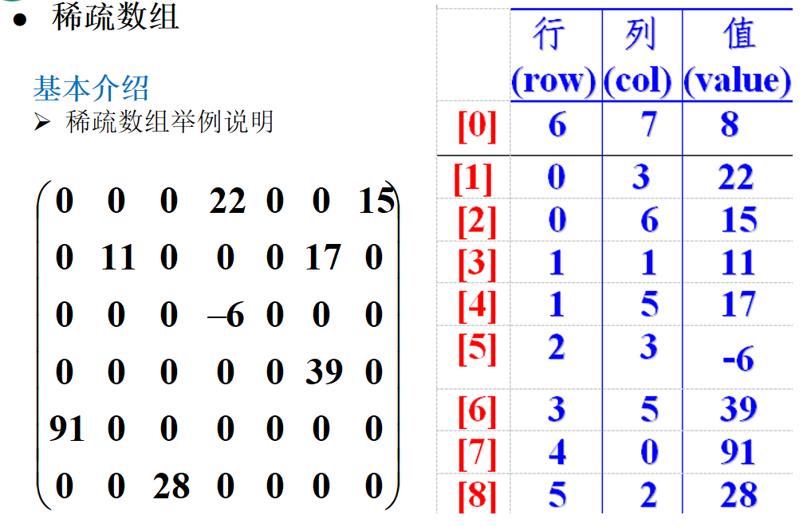
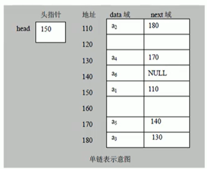

##  稀疏数组

我们如果要编写一个五子棋的程序，要求有存盘退出和读取上盘的功能

我们可能会想到的解决方案：

1. 五子棋对应着一个二维数组。
1. 黑白棋分别在二维数组中存放记录，我们不能使用0来代表黑或白棋，因为数组默认值是 0。
1. 我们使用二维数组记录好棋盘之后，存盘退出功能可以保存为一个文件。
1. 读取上盘的功能可以写为读取之前保存的文件即可。

这个方案可以，但是因为数组中的默认值是 0，所以保存了很多无意义的数值，我们要对它进行改动，下面就是引入稀疏数组的概念。

**稀疏数组**

当一个数组中大部分为同一个值时，我们可以使用稀疏数组来保存该数组，它的思想是：不去保存相同的大部分的值，而是保存不同的值来缩小存储的规模。



上图中第零行的 6、7、8 代表的是六行七列，共八个不同于 0 的数值。第二行到最后一行是对应到原始数组的位置和值。

**案例**

```java
/**
 * 数组转为稀疏数组
 *
 * @return 稀疏数组
 */
private static int[][] anArrayIntoSparseArray() {
    /**
     * 创建一个原始的二维数组 11*11 作为五子棋
     * 0 表示没有棋子，1 代表黑子，2 代表白子
     */
    int[][] originalArray = new int[11][11];

    //让第二行第三列下黑子，第三行第四列下白子
    originalArray[1][2] = 1;
    originalArray[2][3] = 2;

    // 输出原始的二维数组
    System.out.println("——————————————原始的二维数组——————————————");
    Arrays.stream(originalArray).forEach(e -> {
        Arrays.stream(e).forEach(h -> {
            System.out.print(h + "\t");
        });
        System.out.println();
    });

    // 将二维数组转换为稀疏数组
    // 令 sum 为不同于 0 的值的个数
    int sum = 0;
    for (int i = 0; i < originalArray.length; i++) {
        for (int j = 0; j < originalArray[i].length; j++) {
            sum = originalArray[i][j] == 0 ? sum : ++sum;
        }
    }

    // 创建对应的稀疏数组
    int sparseArray[][] = new int[sum + 1][3];
    // 给稀疏数组赋值
    sparseArray[0][0] = originalArray.length;
    sparseArray[0][1] = originalArray[0].length;
    sparseArray[0][2] = sum;
    //count 用于记录是第几个非 0 数据
    int count = 1;
    for (int i = 0; i < originalArray.length; i++) {
        for (int j = 0; j < originalArray[i].length; j++) {
            if (originalArray[i][j] != 0) {
                sparseArray[count][0] = i;
                sparseArray[count][1] = j;
                sparseArray[count][2] = originalArray[i][j];
                count++;
            }
        }
    }

    // 输出稀疏数组
    System.out.println("——————————————稀疏数组——————————————");
    Arrays.stream(sparseArray).forEach(e -> {
        Arrays.stream(e).forEach(h -> {
            System.out.print(h + "\t");
        });
        System.out.println();
    });
    return sparseArray;
}
```

```
——————————————原始的二维数组——————————————
0	0	0	0	0	0	0	0	0	0	0
0	0	1	0	0	0	0	0	0	0	0
0	0	0	2	0	0	0	0	0	0	0
0	0	0	0	0	0	0	0	0	0	0
0	0	0	0	0	0	0	0	0	0	0
0	0	0	0	0	0	0	0	0	0	0
0	0	0	0	0	0	0	0	0	0	0
0	0	0	0	0	0	0	0	0	0	0
0	0	0	0	0	0	0	0	0	0	0
0	0	0	0	0	0	0	0	0	0	0
0	0	0	0	0	0	0	0	0	0	0
——————————————稀疏数组——————————————
11	11	2
1	2	1
2	3	2
```

---

```java
/**
 * 稀疏数组转为原始数组
 */
private static int[][] turnOriginalArraySparseArray(int[][] sparseArray) {
    // 新建一个二维数组，作为原始数组
    int originalArray[][] = new int[sparseArray[0][0]][sparseArray[0][1]];

    // 将稀疏数组中的数据读取出来，并赋给原始的数组
    for (int i = 1; i < sparseArray.length; i++) {
        originalArray[sparseArray[i][0]][sparseArray[i][1]] = sparseArray[i][2];
    }

    // 输出恢复之后的二维数组
    System.out.println("——————————————恢复之后的二维数组——————————————");
    Arrays.stream(originalArray).forEach(e -> {
        Arrays.stream(e).forEach(h -> {
            System.out.print(h + "\t");
        });
        System.out.println();
    });
    return originalArray;
}
```

```
——————————————稀疏数组——————————————
11	11	2
1	2	1
2	3	2
——————————————恢复之后的二维数组——————————————
0	0	0	0	0	0	0	0	0	0	0
0	0	1	0	0	0	0	0	0	0	0
0	0	0	2	0	0	0	0	0	0	0
0	0	0	0	0	0	0	0	0	0	0
0	0	0	0	0	0	0	0	0	0	0
0	0	0	0	0	0	0	0	0	0	0
0	0	0	0	0	0	0	0	0	0	0
0	0	0	0	0	0	0	0	0	0	0
0	0	0	0	0	0	0	0	0	0	0
0	0	0	0	0	0	0	0	0	0	0
0	0	0	0	0	0	0	0	0	0	0
```

## 队列

队列是一个有序的列表，可以用数组或者链表来实现。遵循先入先出的原则，即：先存入队列的数据，要先取出，后存入的后取出。

**案例**

```java
/**
 * 使用这个类去模拟数组队列
 */
class ArrayQueue {

    // 队列的最大容量
    private int maxSize;

    // 队列的头部
    private int front;

    // 队列的尾部
    private int rear;

    // 使用数组来作为队列
    private int[] queue;


    /**
     * 队列的构造方法
     *
     * @param max 队列的容量
     */
    public ArrayQueue(int max) {
        maxSize = max;
        queue = new int[maxSize];

        /*
            初始化队列头部和队列尾部，虽然这两个都是-1，但是意义是不一样的:

            - front 的意义是最初数据的前一位，所以我们在初始化的时候指向的是 -1
            - rear 指向的就是队列的最后一个数据，在初始化的时候只不过因为队列现在不能有数据，所以队列尾部也指向 -1
         */
        front = -1;
        rear = -1;
    }

    /**
     * 判断队列是否为空
     * 只要里面有数据，那么根据我们设定的：
     *
     * 1. 这个数组模拟的队列只是一个普通的队列，而不是环形队列
     * 2. 因为不是环形队列，所以满足：front 永远指向第一个数据的前一位，那么它和 rear 就不能相同
     * 3. 只有当 front == rear 时，才证明里面没有数据
     *
     * @return
     */
    public boolean isEmpty() {
        return front == rear;
    }


    /**
     * 判断队列中的数据是否满了
     *
     * 同样的，只有不是环形队列的条件下，我们才敢这么玩
     *
     * @return
     */
    public boolean isFull() {
        return rear == maxSize - 1;
    }

    /**
     * 增加数据，入队列
     */
    public void addQueue(int n) {
        if (isFull()) {
            throw new RuntimeException("队列已满...");
        }

        //首先令 rear 指针 +1
        rear++;
        queue[rear] = n;
    }


    /**
     * 获取数据，出队列
     *
     * @return
     */
    public int getQueue() {
        if (isEmpty()) {
            throw new RuntimeException("队列为空...");
        }
        //首先令 front 指针+1
        front++;

        //我们其实不用将它重置为 0，只需要将指针指向这个数据就够了，因为按照我们设定的，front 永远指向有效值的前一位
        return queue[front];
    }


    /**
     * 展示所有队列数据
     */
    public void showQueue() {
        if (isEmpty()) {
            throw new RuntimeException("队列为空...");
        }
        for (int i = front + 1; i <= rear; i++) {
            System.out.printf("arr[%d]=%d\n", i, queue[i]);
        }
    }

    /**
     * 查看队列头元素信息
     *
     * @return
     */
    public int peek() {
        if (isEmpty()) {
            throw new RuntimeException("队列为空...");
        }
        return queue[front + 1];
    }
}
```

**数组模拟队列的缺陷**

数组模拟的普通队列是有很大问题的：

- 首先数组只能加满一次，当我们加满之后，即使全部删除了，也会提示队列已满。
- 我们判断 isEmpty 和 isFull 是很有问题的。

因此需要将数组模拟的队列改为环形队列，也就是说 header 和 rear 不一定在哪了。

**环形队列案例**

```java
/**
 * 环形数组队列
 */
class AnnularArrayQueue {

    private int maxSize;
    private int front;
    private int rear;
    private int[] queue;


    /**
     * 队列的构造方法
     *
     * @param max 队列的容量
     */
    public AnnularArrayQueue(int max) {
        maxSize = max;
        queue = new int[maxSize];

        /*
            front 指向的是头元素，rear 指向的是尾元素 +1
            初始化的时候都是 0，我们类的属性是有初始化值的，所以不需要定义
         */
    }

    /**
     * 判断队列是否为空
     * <p>
     * 1. 初始化没有数据的时候，我们的 rear 和 front 现在设定为 0
     * 2. 当一旦有了值 rear 就要指向最后元素的下一个位置，front 指向第一个元素的位置，也就是说只要有一个值，front 和 rear 就不会相同
     * 3. 假如我们先添加几个数值，然后在删除所有的数值，front 和 rear 依然相等
     *
     * @return
     */
    public boolean isEmpty() {
        return front == rear;
    }


    /**
     * 判断队列中的数据是否满了
     * <p>
     * 作为环形队列，rear 的下标有可能会到 front 的前面去
     *
     * @return
     */
    public boolean isFull() {
        return (rear + 1) % maxSize == front;
    }

    /**
     * 增加数据，入队列
     */
    public void addQueue(int n) {
        if (isFull()) {
            throw new RuntimeException("队列已满...");
        }

        //rear 指向最后一个元素的下一个位置，即使初始化的时候也是没有值的，所以我们直接可以让值指向 rear 即可
        queue[rear] = n;
        //令 rear 指针 +1，指向最后一个元素的下一个位置，在这里有可能会出现到数组的开头，所以必须考虑取模
        rear = (rear + 1) % maxSize;
    }


    /**
     * 获取数据，出队列
     *
     * @return
     */
    public int getQueue() {
        if (isEmpty()) {
            throw new RuntimeException("队列为空...");
        }
        //front 指向第一个元素的位置，得到第一个元素，出队列
        int result = queue[front];
        //front 指向第一个元素的位置，也是要考虑取模的
        front = (front + 1) % maxSize;
        return result;
    }


    /**
     * 展示所有队列数据
     */
    public void showQueue() {
        if (isEmpty()) {
            throw new RuntimeException("队列为空...");
        }
        /*
            从 front 开始遍历，遍历 n 个元素
            这个 n 就是我们说的有效数据的个数，那么就是 (rear - front + maxSize) % maxSize
            那么我们的有效数据的个数就求出来了，但是还不够，因为我们有效数据的个数有可能会超出数组的最大容量，所以我们还要考虑到取模的问题
         */
        for (int i = front; i < front + size(); i++) {
            //anArrayRMS：数组有效值，也就是说我们算出来的值对应到数组中的有效数据下标是多少
            int anArrayRMS = i % maxSize;
            System.out.printf("arr[%d]=%d\n", anArrayRMS, queue[anArrayRMS]);
        }
    }

    /**
     * 求当前队列有效数据的个数
     */
    public int size() {
        return (rear - front + maxSize) % maxSize;
    }


    /**
     * 查看队列头元素信息
     */
    public int peek() {
        if (isEmpty()) {
            throw new RuntimeException("队列为空...");
        }

        //这里也需要变为 front
        return queue[front];
    }
}
```


## 链表

链表：LinkedList，是一个有序的列表，链表由一个一个的节点来存储的，这些节点可以不是连续的，这是由链表的结构来决定的：

- `data`：存放数据。
- `next`：执行下一个节点地址，如果没有下一个则为空。

链表分为带有头指针和不带头指针的两种类型，具体的如下图：



**案例**

```java
@Data
@NoArgsConstructor
@AllArgsConstructor
public class Node {

  private Integer id;
  private String name;
  private Node next;
}
```

```java
import java.util.Objects;

public class SingleLinkedList {

  // 头结点
  private Node head = new Node(0, "head", null);

  public void add(Node node) {
    /*
      1. 找到 last node
      2. 将老的 last node 指向新的节点，然后新的节点成为 last node
     */
    Node temp = head;
    while (Objects.nonNull(temp.getNext())) {
      temp = temp.getNext();
    }
    temp.setNext(node);
  }

  public void update(Node node) {
    Node temp = head;
    Integer nodeId = node.getId();
    while (true) {
      if (temp.getId().equals(nodeId)) {
        break;
      }
      temp = temp.getNext();
    }
    temp.setName(node.getName());
  }

  public void delete(Integer id) {
    Node temp = head;
    while (true) {
      Node next = temp.getNext();
      if (Objects.isNull(next)) {
        return;
      }
      Integer nextId = next.getId();
      if (nextId.equals(id)) {
        break;
      }
      temp = temp.getNext();
    }
    temp.setNext(temp.getNext().getNext());
  }
}
```

**双向链表**

单链表其实是有缺点的，就是只能走一个方向，并且不能自我删除，需要依靠辅助节点。

双向链表和单项链表的区别就是增加了一个指向上个节点的指针 `prev`，但是这样一来就可以向前走，并且可以自行删除节点了。

双向链表类似单项链表，也比较简单，不做演示。

## 栈

Stack：栈，栈是一个先进后出（FILO：First In Last Out）的有序列表，栈只能在线性表的同一端进行操作，允许插入和删除的一段称为栈顶，另一端固定不变称为栈底。

我们就想象一下矿泉水瓶，就能很好理解。入栈有一个专业的名字叫做 push，出栈也有一个专业的名词叫 pop。

栈的应用场景：

- 子程序的调用：在调用子程序之前，先将下个指令的地址存到堆栈中，子程序执行完成后再将地址取出，return 到原来的程序中。
- 递归处理。
- 表达式的转换【中缀表达式转后缀表达式】和求值。
- 二叉树的遍历。
- 图形的深度优先搜索法。

**案例**

```java
class ArrayStack {

    //栈的最大大小
    private int maxSize;
    //使用数组模拟栈
    private int[] stack;
    //栈顶，初始化为-1
    private int top = -1;

    public ArrayStack(int maxSize) {
        this.maxSize = maxSize;
        stack = new int[this.maxSize];
    }

    //栈满了
    public boolean isFull() {
        return top == maxSize - 1;
    }

    //栈空
    public boolean isEmpty() {
        return top == -1;
    }

    //入栈
    public void push(int value) {
        if (isFull()) {
            System.out.println("栈满了");
            return;
        }

        top++;
        stack[top] = value;
    }

    //出栈
    public int pop() {
        if (isEmpty()) {
            throw new RuntimeException("栈空了");
        }
        int value = stack[top];
        top--;
        return value;
    }

    //遍历栈
    public void list(){
        if (isEmpty()){
            System.out.println("栈空，无数据");
            return;
        }
        for (int i = top; i >= 0; i--) {
            System.out.printf("stack[%d]=%d \n",i,stack[i]);
        }
    }
}
```

**前缀表达式（波兰表达式）**

前缀表达式又称波兰式，前缀表达式的运算符都位于操作符之前。

比如 `( 3 + 4 ) * 5 - 6` 对应的前缀表达式就是 `- * + 3 4 5 6`，里面的符号并不是按照出现的顺序出现的。

计算机中对前缀表达式求值：

- 从右向左扫描前缀表达式，而不是从左向右。
- 遇到数字将数字压入栈。
- 遇到运算符，弹出栈顶的两个数，运算符对他们进行计算，并将结果入栈。
- 重复上述过程，直到表达式最左端，最后运算出的结果即为表达式的结果。

比如我们刚才的 `( 3 + 4 ) * 5 - 6`：

- 从右向左运算，将 6、5、4、3 进行入栈。
- 遇到 + 运算符，弹出 3 和 4，得到 7 入栈，那么栈中就是 6、5、7。
- 遇到 * 运算符，弹出 7 和 5，计算出结果 35，将 35 入栈，因此栈中就是 6、35。
- 遇到 - 运算符，计算出 `35 - 6`，将 29 入栈。

**中缀表达式**

中缀表达式就是我们最常见的运算表达式，比如`( 3 + 4 ) * 5 - 6`，中缀表达式是人类最熟悉的，但是对计算机来却不好操作，要进行优先级排序。

往往中缀表达式在计算的时候要转换为后缀表达式。

**后缀表达式（逆波兰表达式）**

后缀表达式又称逆波兰表达式，操作符位于操作数之后。例如 `( 3 + 4 ) * 5 - 6` 对应的后缀表达式为 `3 4 + 5 * 6 -`。

再比如：

```
a + b				a b +
a + (b - c)			a b c - +
a + d * (b - c)		a d b c - * +
a = 1 + 3			a 1 3 + =
```

计算过程：

- 从左向右扫描后缀表达式。
- 遇到数字将数字压栈。
- 遇到运算符，弹出栈顶的两个数，用运算符进行计算，将结果入栈。
- 重复上述过程，最后的结果为表达式的结果。

比如说我们的 `( 3 + 4) * 5 - 6`，对应的后缀表达式是 `3 4 + 5 * 6 -`：

1. 从左向右，将 3 和 4 压栈。
1. 遇到 + 运算符，弹出 3 和 4，计算出 7 压栈。
1. 遇到 5，压栈
1. 遇到 *，弹出 7 和 5，计算出 35 压栈。
1. 遇到 6 压栈。
1. 遇到 -，将 35 和 6 弹出，计算出 29 压栈（这里应该是 `35 - 6`）。

**中缀表达式转后缀表达式**

后缀表达式比较适合计算式进行运算，但是人却不太容易写出来，尤其是表达式很长的情况，因此我们在开发中需要将中缀表达式转换为后缀表达式

1. 初始化两个栈：运算符栈 s1 和存储中间结果的栈 s2
1. 从左向右扫描中缀表达式。
1. 遇到操作数压到 s2。
1. 遇到运算符时，比较其和 s1 栈顶运算符的优先级：

    - 假如 s1 为空，或者栈顶运算符为 `(`，直接入栈。
    - 假如优先级高于栈顶优先级，直接入栈，这里注意，括号不算运算符，遇到括号也直接入栈即可。
    - 假如优先级小于等于栈顶优先级，将 s1 栈顶运算符弹出并压入到 s2 中，再次转到步骤 4 进行比较。

1. 遇到括号时：

    - 如果是左括号，直接入栈。
    - 如果是右括号，则一次弹出 s1 栈顶的运算符，并压入 s2，直到遇到左括号为止，此时将这一对括号丢弃。

1. 重复步骤 2 至步骤 5，直到达到表达式的最右边。
1. 将 s1 中剩余的运算符依次弹出并压入 s2
1. 依次弹出 s2 中的元素并输出，结果的逆序即为中缀表达式对应的后缀表达式。

我们使用中缀表达式 `1 + ( ( 2 + 3 ) * 4 ) - 5`，转换为后缀表达式，这里建议自己画个图试试，最后得到的是 `1 2 3 + 4 * + 5 -`。
