## 哈希表

Java 中的 HashMap 其实就是哈希表，底层其实是 ==数组 + 链表/红黑树== 的方式，这种情况也就是哈希表（散列表）。

哈希表查询效率相当快，当插入/查询时，首先根据 key 运算得到存储到哪个数组中，然后从数组中的某个位置进行查找/插入。

**哈希表简单实现**

以公司员工为例，进行增删改查。

```java
// 链表节点
class Emp {

	public Integer id;
	public String name;
    //next节点默认为null
	public Emp next;

	public Emp(Integer id, String name) {
		super();
		this.id = id;
		this.name = name;
	}
}
```

```java
// 链表
class EmpLinkedList {
	// EMP,链表的头指针默认为 null
	private Emp head;

	public void add(Emp emp) {
		if(head == null) {
			head = emp;
			return;
		}
		// 定义一个临时节点，用于遍历整个链表
		Emp curEmp = head;
		while(true) {
            // 找到链表的最后一个节点，我们向链表的最后插入
			if(curEmp.next == null) {
				break;
			}
			curEmp = curEmp.next;
		}
        // 如果不是最后一个节点，那么继续寻找下一个节点，直到找到最后一个节点
		curEmp.next = emp;
	}

	// 遍历链表
	public void list(int no) {
		if(head == null) {
			return;
		}
		// 定义一个临时节点
		Emp curEmp = head;
		while(true) {
			System.out.printf(" => id=%d name=%s\t", curEmp.id, curEmp.name);
			if(curEmp.next == null) {
				break;
			}
			curEmp = curEmp.next;
		}
		System.out.println();
	}

    // 根据员工的 ID 号寻找对应的员工
	public Emp findEmpById(int id) {

		if(head == null) {
			return null;
		}
		// 临时节点，遍历链表
		Emp curEmp = head;
		while(true) {
			if(curEmp.id == id) {
				break;
			}

			if(curEmp.next == null) {
				curEmp = null;
				break;
			}
			curEmp = curEmp.next;
		}

		return curEmp;
	}

}
```

```java
// 哈希表
class HashTab {
    // 哈希表中，对应的数组，数组是链表的数组
	private EmpLinkedList[] empLinkedListArray;
	private int size;

	public HashTab(int size) {
		this.size = size;

		empLinkedListArray = new EmpLinkedList[size];

		for(int i = 0; i < size; i++) {
			empLinkedListArray[i] = new EmpLinkedList();
		}
	}

	// 添加
	public void add(Emp emp) {
		// 取余，这里模拟的是进行哈希算法得出来的下标，应该将节点插入到哪个数组索引下
		int empLinkedListNO = hashFun(emp.id);

		empLinkedListArray[empLinkedListNO].add(emp);

	}

	public void list() {
		for(int i = 0; i < size; i++) {
			empLinkedListArray[i].list(i);
		}
	}


	public void findEmpById(int id) {
		// 取余，这里模拟的是进行哈希算法得出来的下标，应该将节点插入到哪个数组索引下
		int empLinkedListNO = hashFun(id);
		Emp emp = empLinkedListArray[empLinkedListNO].findEmpById(id);
		if(emp != null) {
			System.out.println(emp);
		}else{
			System.out.println("查询不到");
		}
	}

    // 取余，这里模拟的是进行哈希算法得出来的下标，应该将节点插入到哪个数组索引下
	public int hashFun(int id) {
		return id % size;
	}
}
```

```java
public class HashTabDemo {

	public static void main(String[] args) {


		HashTab hashTab = new HashTab(7);


		String key = "";
		Scanner scanner = new Scanner(System.in);
		while(true) {
			System.out.println("add:  添加");
			System.out.println("list: 遍历");
			System.out.println("find: 查找");
			System.out.println("exit: 退出");

			key = scanner.next();
			switch (key) {
			case "add":
				System.out.println("请输入id");
				int id = scanner.nextInt();
				System.out.println("请输入name");
				String name = scanner.next();
				Emp emp = new Emp(id, name);
				hashTab.add(emp);
				break;
			case "list":
				hashTab.list();
				break;
			case "find":
				System.out.println("请输入id");
				id = scanner.nextInt();
				hashTab.findEmpById(id);
				break;
			case "exit":
				scanner.close();
				System.exit(0);
			default:
				break;
			}
		}
	}
}
```

## 树

### 树基础

**为什么需要树**

数组查找快，但是数组长度固定不变，想要增加元素只能整体移动到新数组上，效率低。链表插入快，但是在检索就比较慢了。

树这种数据结构在插入时也块，在检索时也块，可以同时保证检索、插入、删除、修改的速度。除了实现麻烦、空间利用率大一点之外，在效率上吊打数组和链表。

**基本术语**

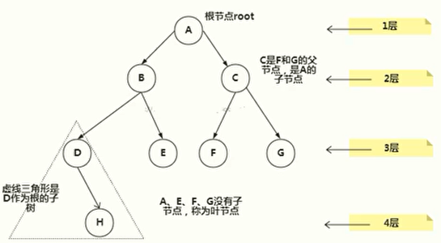

| 概念     | 意义                                                                                          |
| -------- | --------------------------------------------------------------------------------------------- |
| 节点     | 节点就是对象，其中 A、B、C、D、E、F、G、H 都是节点                                            |
| 父节点   | D 就是 H 的父节点。B 是 D 的父节点。A 是 B 的父节点。\n 也就是说，节点的上一级叫做父节点      |
| 子节点   | 和父节点的概念对应，父节点的下一级叫做子节点                                                  |
| 根节点   | 没有父节点的节点就叫做根节点                                                                  |
| 叶子节点 | 没有子节点的节点就叫做叶子节点                                                                |
| 节点的权 | 就是节点的值                                                                                  |
| 路径     | 从根节点到该节点的路线。比如找到 D 应该 A->B->D                                               |
| 层       | 比如 A 就是第一层，B 和 C 位于第二层，DEFG 位于第三层，H 位于第四层                           |
| 树的高度 | 一颗树有多少层                                                                                |
| 子树     | 在虚线的三角形中，D 和 E 两者可以叫做 A 的子树，可以叫做 B 的子树。在这颗子树中，D 为根节点。 |
| 森林     | 多颗子树构成森林                                                                              |
| 节点的度 | 就是一个节点下面子树的个数，比如二叉树，他的节点的度就是2                                     |
| 树的度   | 这棵树中，所有节点的度的最大值                                                                |

### 二叉树

**普通二叉树**

二叉树的意思就是，一个节点最多只能有两个子节点，并且子节点要明确分为左子节点和右子节点。

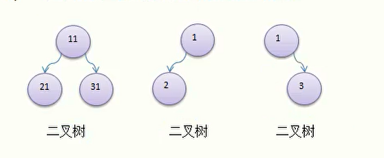

假如二叉树的所有叶子节点都在最后一层或者倒数第二层，并且最后一层的叶子节点从左边开始连续，倒数第二层的叶子节点从右边开始连续，我们称为完全二叉树。

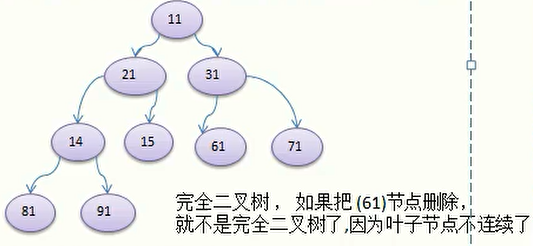

连续就是说每一个叶子节点都挨着，比如说 71 挨着 61，61 挨着 15。假如去掉 71、61、15、14 任何一个，倒数第二层都不叫连续。假如去掉 81，倒数第一层不叫连续。去掉 91，倒数第一层叫做连续。

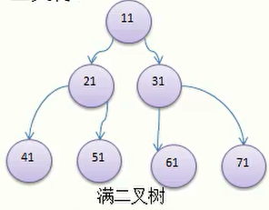

假如二叉树的所有叶子节点都在最后一层，并且节点的总数为 `2^n-1`（n为层数），则我们称为满二叉树

二叉树的实现方式类似链表，只不过链表只有一个子节点，而二叉树可以有两个子节点。

**二叉树的前序、中序、后序遍历**

二叉树的前中后是针对父节点来说的，而左子树必定优先于右子树：

- 前序遍历：遍历顺序为：父节点 -> 左子树 -> 右子树。
- 中序遍历：遍历顺序为：左子树 -> 父节点 -> 右子树。
- 后序遍历：遍历顺序为：左子树 -> 右子树 -> 父节点。

**顺序存储二叉树**

数组其实可以转换为树，树也可以转换为数组。能实现这种需求的就是顺序存储二叉树。

简单来说，顺序二叉树：

1. 只考虑完全二叉树。
1. 第 n 个左子节点的下标为 `2 * n + 1`（n 为转换之后的数组下标，也就是从 0 开始的数组节点）。
1. 第 n 个右子节点的下标为 `2 * n + 2`。
1. 第 n 个元素的父节点下标为 `(n - 1) / 2`。

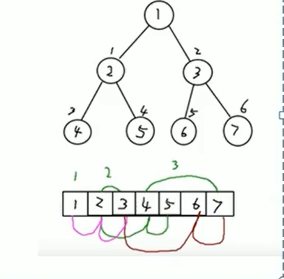

在图中，树的下标为 0-6，那么我们举一个例子，就以下标为 1，值为 2 的树节点为例子：

第 1 个元素（也就是下标为 1 的节点）

- 左子节点为 `2 * 1 + 1 = 3`，也就是下标为 3，值为 4 的节点。
- 右子节点为 `2 * 1 + 2 = 4`，也就是下标为 4，值为 5 的节点。
- 父节点为 `( 2 - 1 ) / 2 = 0`，也就是根节点。

### 赫夫曼树

**带权路径长度 WPL**

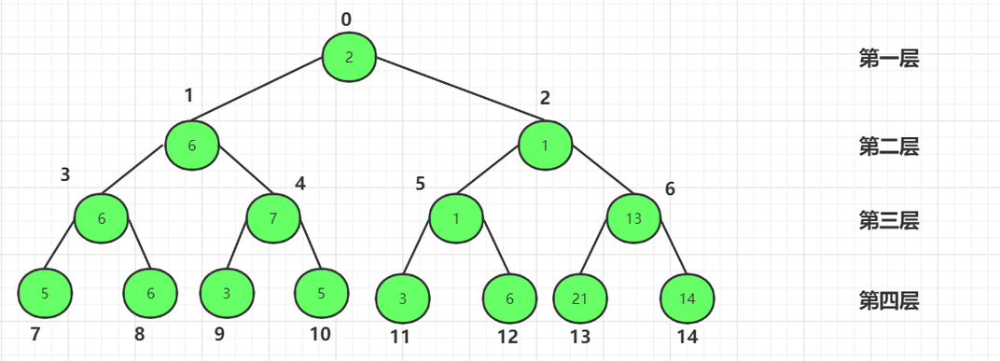

之前我们讲过，权就是节点的值，现在有如上一颗树。那么节点的带权路径，其实就是 `权 * 路径长度`，比如节点 7 就是 `3（路径） * 5（权） = 15`。

树的带权路径长度就是所有的 ==叶子节点== 的带权路径相加。

**赫夫曼树**

也叫做哈夫曼树、霍夫曼树，取决于翻译。赫夫曼树有以下几个特点：

1. 必须为二叉树。
1. 二叉树中，所有的叶子节点必须要有权值。
1. 树的带权路径必须为最小。
1. 赫夫曼树中，权值较大的节点离根很近。

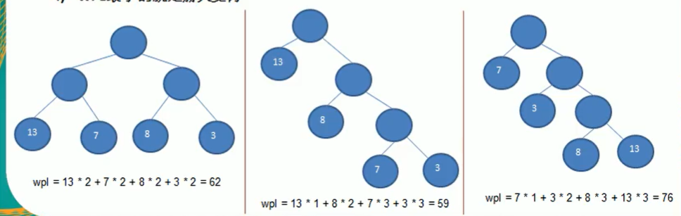

在上图中，第二个的 WPL 最小，所以它就是赫夫曼树。

**赫夫曼树的创建步骤**

1. 将指定的数列从小到大进行排序，每一个数据都可看成一个节点，每个节点都可看成一颗没有左右子树的二叉树。
1. 取根节点权值最小的两颗二叉树。
1. 将取出的两颗二叉树组成一颗新的二叉树，其中左子树与右子树两者的父节点的权为二者相加，将此二叉树放入队列中。
1. 将这颗新的数和其他的二叉树进行排序，重复 2-4 步骤，直到所有数据均被处理。

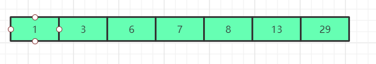

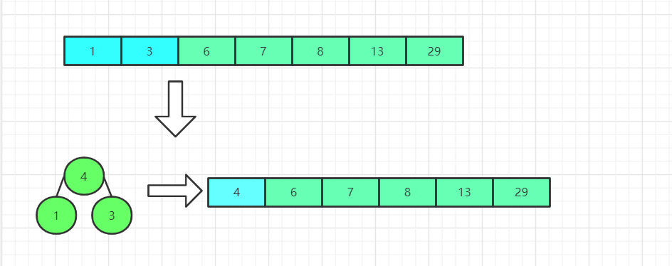

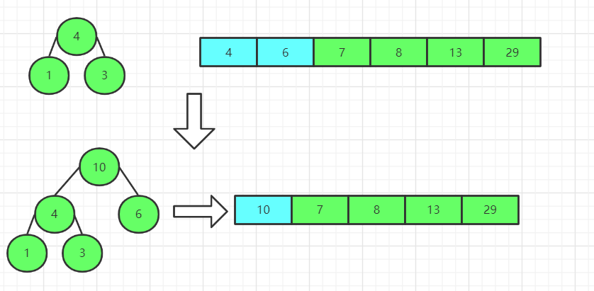

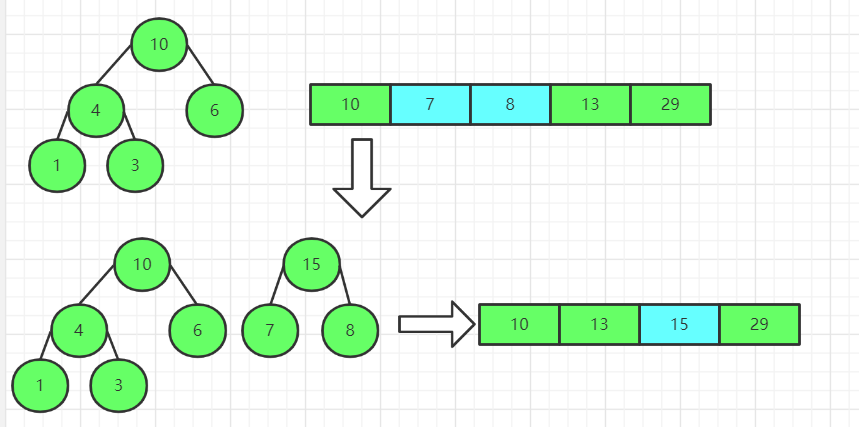

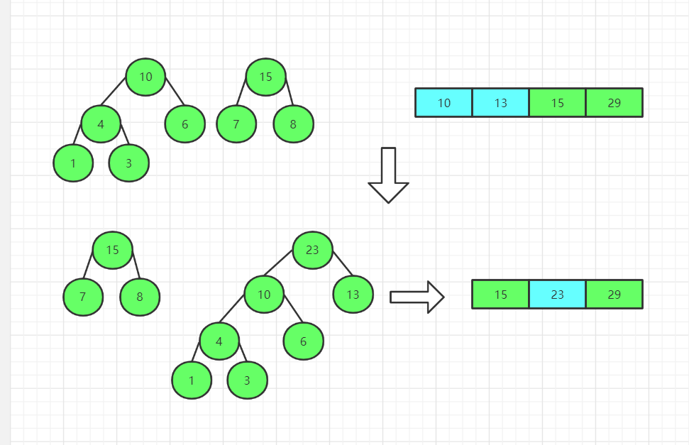

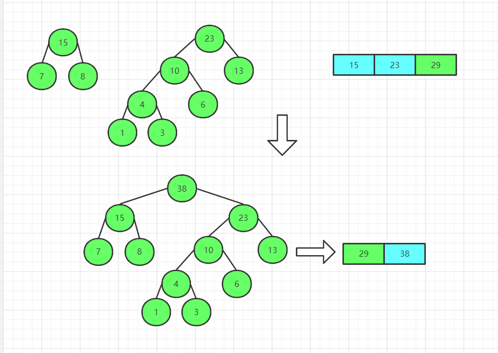

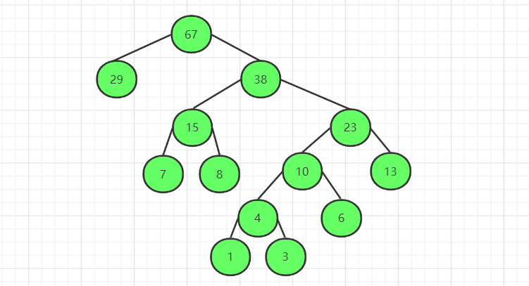

### 二叉排序（查找）树 BST
