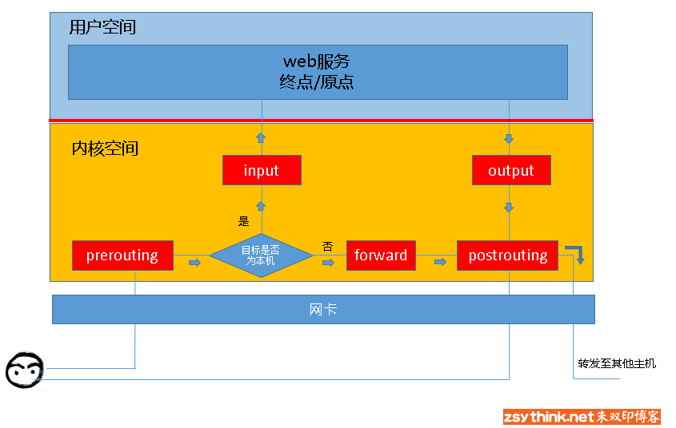
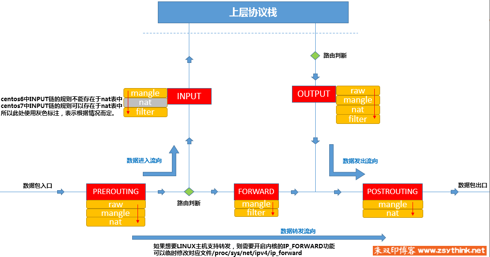

## iptables 概念

Linux 内核中内置了网络安全框架 netfilter，我们配置 iptables 去操作这个安全框架，实现一些网络功能，包括过滤、重定向、网络地址转换（NAT）等功能。

配置 iptables 的过程就是对规则定义的过程，在我们将这些规则称为链，报文经过了这些链之后会决定报文之后的行为，是被放行、拦截、丢弃，这些全都是需要看链是如何指定的。

上图中共有五道关卡，在常用场景中，报文可以有如下流向：

- 客户端到服务端：client -> prerouting -> input -> server
- 服务端到其他服务端：server -> output -> postrouting -> other server
- 客户端经过服务端转发，到其他服务端：client -> prerouting -> forward -> postrouting -> other server

每道关卡中都可以定义规则链，根据常用的规则链可以对报文进行不同的操作。

之前说过，我们可以通过 iptables 去定义链，iptables 顾名思义，就是各种表，这些表中可以定义规则链。iptables 共给我们分了四张表的集合，用于不同的功能：

- filter：此表负责过滤、防火墙。对应的 netfilter 中的内核模块是 iptable_filter。
- nat：此表负责网络地址转换（NAT）。对应的 netfilter 中的内核模块是 iptable_nat。
- mangle：此表负责修改报文。对应的 netfilter 中的内核模块是 iptable_mangle。
- raw：此表负责关闭 nat 表上启用的链接追踪机制。对应的 netfilter 中的内核模块是 iptable_raw。

四张表的规则链先后执行顺序为：raw -> mangle -> nat -> filter。

需要注意的是，不是每道关卡都有这四张表的全部功能，事实上，除了 output 之外，其余的关卡都只能有这四张表中的某几张表的功能，如下图：

假如我们的某个服务想要拦截某个 IP 的数据，则必须要在 INPUT 或者 PREROUTING 关卡上拦截，但是 PREROUTING 不能在 filter 表上配置规则，所以我们只能在 INPUT 关卡上进行拦截。
