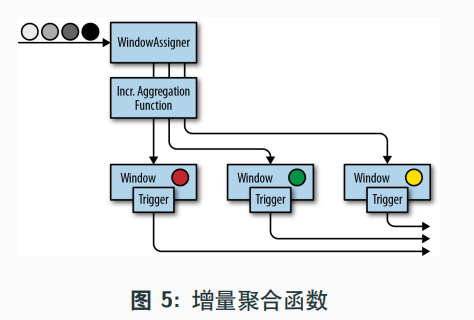
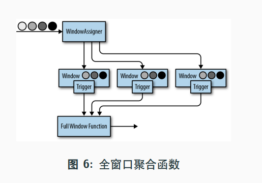
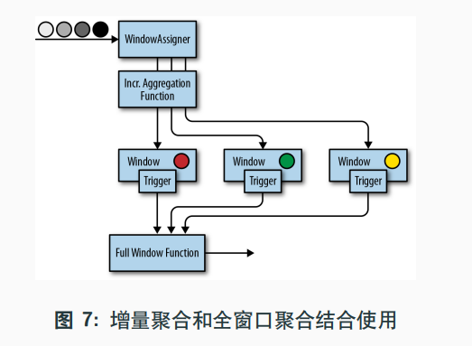
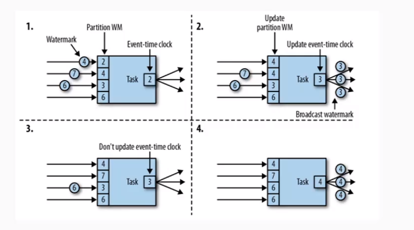
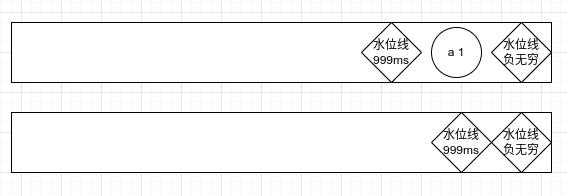
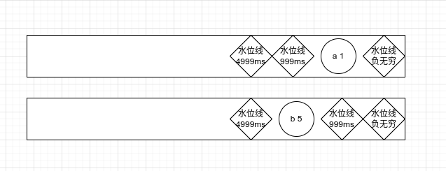
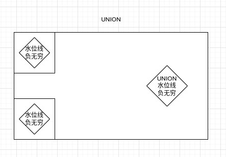
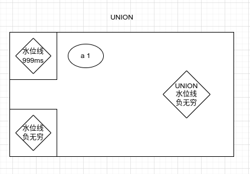
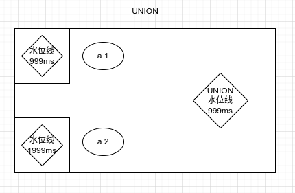

## 窗口

一般来说，真实数据都是无界流，那么我们如何去处理？其实就是将无界流切为有界流进行处理。窗口其实就是切分的一种方式，它会将流数据分发到不同的桶中进行分析。

窗口类型有两种：

- 时间窗口 Time Window：
    - 滚动时间窗口
    - 滑动时间窗口
    - 会话窗口（只有 Flink 支持）
- 计数窗口 Count Window：
    - 滚动计数窗口
    - 滑动计数窗口

其中时间窗口是比较重要的，我们以时间窗口为主。

**滚动窗口、滑动窗口、会话窗口**


滚动窗口就是普通的窗口，数据按照窗口长度进行切分，窗口之间没有重叠。


是窗口大小 + 一段滑动距离组成，滑动间隔可以为 0，那样就成为了滚动窗口。

一个元素可能同时存在多个窗口中，但是这种存在多个窗口的实现方式其实是复制。元素将会复制多份，每个窗口都存放此元素。所以假如窗口交集比较多，那么最终会存在很多冗余的元素。


注意，这个会话窗口并不是真正的 HTTP sesion，它的意思是说，指定一个超时时间，假如过了这个时间还没有收到新的数据那就会生成新的窗口。

特点就是时间不定长。

---

以处理时间为例：

```java
// 滚动窗口，给定窗口大小
.window(TumblingProcessingTimeWindows.of(Time.seconds(5)))
// 滑动窗口，给定窗口大小、滑动距离
.window(SlidingProcessingTimeWindows.of(Time.seconds(10), Time.seconds(5)))
// 会话窗口，给定超时时间
.window(ProcessingTimeSessionWindows.withGap(Time.seconds(10)))
```

事件时间其实就是将 process 改为 event，例如 `TumblingEventTimeWindows`

## 进阶

处理函数，Process Function，是底层 API。

我们之前使用到的所有函数其实都是基于处理函数来进行实现的，而我们使用处理函数可以实现更加复杂的需求。例如，Flink SQL 就是利用 Process Function 来实现的。

Flink 提供了 8 个 Process Function：

- `ProcessFunction`
- `KeyedProcessFunction`
- `CoProcessFunction`
- `ProcessJoinFunction`
- `BroadcastProcessFunction`
- `KeyedBroadcastProcessFunction`
- `ProcessWindowFunction`
- `ProcessAllWindowFunction`

所有的 Process Function 都继承了 RichFunction 接口，所以都有富函数的优点。

### KeyedProcessFunction

用来操作 keyBy 之后的流，输出 0 个、1 个 或多个。可以看成是 flatMap 和 reduce 的终极加强版。

除了富函数的函数，还额外提供了两个方法：

- `processElement(I value, Context ctx, Collector<O> out)`：流中的每一个元素都会调用此方法。

    流中的每一个元素都会调用此方法，结果会放到 collector 数据类型中输出。

    Context 可访问元素的时间戳、key、TimeService 时间服务，还可以输出元素到别的流。

- `onTimer(long timestamp, OnTimerContext ctx, Collector<O> out)`：回调函数，定时器：

    定时器的回调函数，可以在定时器倒计时结束之后调用。

    timestamp 是定时器触发的时间戳。

    Collector 是输出集合。

    OnTimerContext 类似 processElement 的 Context。

```java
StreamExecutionEnvironment env = StreamExecutionEnvironment.getExecutionEnvironment();
env.setParallelism(1);

env
    .socketTextStream("localhost", 9999)
    // keyedProcessFunction 需要的是 keyBy 之后的 流，所以先分流
    .keyBy(r -> 1)
    /*
      1. 调用一个 process function 的方式，就是 .process()
      2. 三个泛型分别为： key、输入、输出
    */
    .process(new KeyedProcessFunction<Integer, String, String>() {
      /**
       * 每个元素都会调用此方法处理
       */
      @Override
      public void processElement(String value, KeyedProcessFunction<Integer, String, String>.Context ctx, Collector<String> out) throws Exception {
        // 获取机器时间
        long ts = ctx.timerService().currentProcessingTime();
        out.collect(String.format("元素 %s 在 %s 到达", value, new Timestamp(ts)));
        // 注册一个十秒钟之后的定时器，十秒钟后将会调用方法 onTimer
        ctx.timerService().registerProcessingTimeTimer(ts + 10 * 1000L);
      }

      /**
       * 定时器，在 processElement 注册之后，时间到达将会调用此回调函数
       */
      @Override
      public void onTimer(long timestamp, KeyedProcessFunction<Integer, String, String>.OnTimerContext ctx, Collector<String> out) throws Exception {
        super.onTimer(timestamp, ctx, out);
        out.collect(String.format("定时器触发，时间为：%s", new Timestamp(timestamp)));
      }
    })
    .print();

env.execute();
```

:::tip
每个 key 都可以注册自己的定时器，对于每个 key，在某个时间戳，只能注册一个定时器。

每个 key 独享定时器，定时器之间在逻辑上相互隔离。
:::

**时间服务和定时器**

除了之前的例子，Context 和 OnTimerContext 持有的 TimeService 对象拥有如下方法：

- `currentProcessingTime()`：返回当前处理时间。
- `currentWatermark()`：返回当前水位线的时间戳
- `registerProcessingTimeTimer(long time)`：会注册当前 key 的 processing time 的 timer。当 processing time 到达定时时间时，触发 timer。
- `registerEventTimeTimer(long time)`：会注册当前 key 的 event time timer。当水位线大于等于定时器注册的时间时，触发定时器执行回调函数。
- `deleteProcessingTimeTimer(long time)`：删除之前注册处理时间定时器。如果没有这个时间戳的定时器，则不执行。
- `deleteEventTimeTimer(long time)`：删除之前注册的事件时间定时器，如果没有此时间戳的定时器，则不执行。

### 状态变量

状态变量，顾名思义，保存状态。我们以一个平均数的需求来开始状态变量。状态变量有很多种，例如 `ValueState`、`MapState`、`ListState`。

```java
StreamExecutionEnvironment env = StreamExecutionEnvironment.getExecutionEnvironment();
env.setParallelism(1);

env
    .addSource(new SourceFunction<Integer>() {
      private boolean shouldRunning = true;
      private Random random = new Random();

      @Override
      public void run(SourceContext<Integer> ctx) throws Exception {
        while (shouldRunning) {
          ctx.collect(random.nextInt(10));
          Thread.sleep(100L);
        }
      }

      @Override
      public void cancel() {
        shouldRunning = false;
      }
    })
    .keyBy(r -> true)
    .process(new KeyedProcessFunction<Boolean, Integer, Double>() {

      /*
        1. 声明状态变量，做累加器，这里声明一个值状态变量
        2. 状态变量的可见范围是当前 key
        3. 不同 key 的状态变量是相互隔离的
        4. 状态变量是单例，只能被实例化一次，这是用于宕机之后检查点恢复的
        5. 我们需要给状态变量起名字，也是用于检查点恢复的
      */
      private ValueState<Tuple2<Integer, Integer>> valueState;
      // 保存定时器时间戳
      private ValueState<Long> timerTs;

      @Override
      public void open(Configuration parameters) throws Exception {
        super.open(parameters);
        // 固定写法，调用 runtimeContext 来获取一个状态变量（给定状态变量的名称和类型）
        valueState = getRuntimeContext().getState(new ValueStateDescriptor<Tuple2<Integer, Integer>>("sumCount", Types.TUPLE(Types.INT, Types.INT)));
        timerTs = getRuntimeContext().getState(new ValueStateDescriptor<Long>("timer", Types.LONG));
      }

      @Override
      public void processElement(Integer value, KeyedProcessFunction<Boolean, Integer, Double>.Context context, Collector<Double> out) throws Exception {
        // 做累加器的操作
        if (Objects.isNull(valueState.value())) {
          valueState.update(Tuple2.of(value, 1));
        } else {
          Tuple2<Integer, Integer> tmp = valueState.value();
          valueState.update(Tuple2.of(tmp.f0 + value, tmp.f1 + 1));
        }

        if (Objects.isNull(timerTs.value())) {
          // 注册十秒钟之后的定时器
          long timer = context.timerService().currentProcessingTime() + 10 * 1000L;
          context.timerService().registerProcessingTimeTimer(timer);
          timerTs.update(timer);
        }
      }

      @Override
      public void onTimer(long timestamp, KeyedProcessFunction<Boolean, Integer, Double>.OnTimerContext ctx, Collector<Double> out) throws Exception {
        super.onTimer(timestamp, ctx, out);
        if (Objects.isNull(valueState.value())) {
          return;
        }
        // 发送数据
        out.collect((double) valueState.value().f0 / valueState.value().f1);
        // 清空定时器的状态变量
        timerTs.clear();
      }
    })
    .print();

env.execute();
```

### ProcessWindowFunction

按照 key 分区完毕，然后按照 window 分区之后，我们就可以使用 `ProcessWindowFunction` 了，它也是一个底层 API。

比如，我们要计算每个用户每 5 秒钟的 pv（其实应该是 0- 4999ms，因为窗口是左闭右开）。

```java
@Data
@NoArgsConstructor
@AllArgsConstructor
public class Event {

  private String user;
  private String url;
  private Long timestamp;
}
```

```java
public class ClickSource implements SourceFunction<Event> {

  private boolean shouldRunning = true;
  private String[] userArr = {"Mary", "Bob", "Alice", "Liz"};
  private String[] urlArr = {"./home", "./cart", "./fav", "./prod?id=1", "./prod?id=2"};
  private Random random = new Random();

  @Override
  public void run(SourceContext<Event> ctx) throws Exception {
    while (shouldRunning) {
      ctx.collect(
          new Event(
              userArr[random.nextInt(userArr.length)],
              urlArr[random.nextInt(urlArr.length)],
              Calendar.getInstance().getTimeInMillis()
          )
      );
      Thread.sleep(1000L);
    }
  }

  @Override
  public void cancel() {
    shouldRunning = false;
  }
}
```

```java
// 每个用户每 5 秒钟的 pv
public class Demo {
  public static void main(String[] args) throws Exception {
    StreamExecutionEnvironment env = StreamExecutionEnvironment.getExecutionEnvironment();
    env.setParallelism(1);

    env
        .addSource(new ClickSource())
        .keyBy(Event::getUser)
        // 先分流，再开窗。这里开了一个 5s 的滚动窗口
        .window(TumblingProcessingTimeWindows.of(Time.seconds(5)))
        // 开窗之后进行 processWindowFunction
        .process(new WindowResult())
        .print();

    env.execute();
  }

  /**
   * 注意，processWindowFunction 的泛型有四个：
   * <p>
   * 1. 输入泛型
   * 2. 输出泛型
   * 3. key 的泛型
   * 4. Window 的泛型，这里自然就是 TimeWindow
   */
  public static class WindowResult extends ProcessWindowFunction<Event, String, String, TimeWindow> {

    /**
     * processWindowFunction 的 process 方法会在窗口结束时调用
     */
    @Override
    public void process(String key, ProcessWindowFunction<Event, String, String, TimeWindow>.Context ctx, Iterable<Event> elements, Collector<String> out) throws Exception {
      // 获取窗口开启时间
      long windowStart = ctx.window().getStart();
      // 获取窗口关闭时间
      long windowEnd = ctx.window().getEnd();
      // 迭代器中的元素个数
      long count = elements.spliterator().getExactSizeIfKnown();
      out.collect(String.format("用户 %s 在窗口 %s - %s 的 pv 次数是 %s", key, new Timestamp(windowStart), new Timestamp(windowEnd), count));
    }
  }
}
```

我们可以看到，上面有一个迭代器，迭代器中保存的是所有的数据，所以像这种函数我们也可以叫做全窗口聚合函数。

其实全窗口聚合函数对于这种累加计算的情况不太好，因为我们需要的是 pv 次数，不需要保留原始数据，所以我们仍然可以参考累加器的思路来进行计算，一条数据加完之后就扔掉，

### AggregateFunction

我们说 processWindowFunction 是一个全窗口聚合函数，但是不太适合累加计算的情况，因为累加不需要保存原始数据。

所以出现了增量聚合聚合方面的函数，一个是 ReduceFunction，一个是 AggregateFunction，其中 AggregateFunction 可以实现更多功能，所以以它为例。

准备工作就是 ProcessWindowFunction 中的 Event 和 ClickSource，主要思路仍然是先分流再开窗，只不过这里的 `process()` 换位了 `aggregate()`

```java
// 每个用户每 5 秒钟的 pv
public class Demo {
  public static void main(String[] args) throws Exception {
    StreamExecutionEnvironment env = StreamExecutionEnvironment.getExecutionEnvironment();
    env.setParallelism(1);

    env
        .addSource(new ClickSource())
        .keyBy(Event::getUser)
        .window(TumblingProcessingTimeWindows.of(Time.seconds(5)))
        // 这里注意，聚合操作直接使用 aggregate 即可，需要使用到的就是 AggregateFunction
        .aggregate(new CountAgg())
        .print();

    env.execute();
  }

  /**
   * AggregateFunction的三个泛型：
   * <p>
   * 1. key 的类型
   * 2. 累加器的泛型
   * 3. 输出泛型
   */
  public static class CountAgg implements AggregateFunction<Event, Integer, Integer> {

    /**
     * 针对每一个窗口，都会创建一个累加器
     *
     * @return 默认数值
     */
    @Override
    public Integer createAccumulator() {
      return 0;
    }

    /**
     * 定义累加规则
     */
    @Override
    public Integer add(Event event, Integer accumulator) {
      return accumulator + 1;
    }

    /**
     * 在窗口关闭时返回结果
     */
    @Override
    public Integer getResult(Integer accumulator) {
      return accumulator;
    }

    /**
     * 当窗口合并的时候，需要实现这个 merge，当前需求我们不需要将窗口合并，不用实现这个
     */
    @Override
    public Integer merge(Integer integer, Integer acc1) {
      return null;
    }
  }
}
```

相对于全窗口聚合函数，优点是不需要知道所有的数据是什么，但是缺点就是无法访问窗口的信息，所以不知道得到的结果属于哪个窗口。

那我们不能接受了，所以我们需要将增量聚合函数和全窗口聚合函数结合使用的例子

### ProcessWindowFunction + AggregateFunction

这里注意，我们之前调用全窗口聚合函数使用的是 `process()`，增量聚合函数是 `aggregate()`，那么如果将两者集合使用，那么其实是用的是 `aggregate()`，只不过这个方法还有第二个参数，就是全窗口聚合函数。

其实增量聚合函数 + 全窗口聚合函数，在这个过程中，全窗口聚合函数的作用其实就是在增量聚合函数的外层包裹一层窗口信息而已。

当窗口闭合的时候，增量聚合函数会将它的结果发送到全窗口聚合函数。







---

```java
// 每个用户每 5 秒钟的 pv
public class Demo {
  public static void main(String[] args) throws Exception {
    StreamExecutionEnvironment env = StreamExecutionEnvironment.getExecutionEnvironment();
    env.setParallelism(1);

    env
        .addSource(new ClickSource())
        .keyBy(Event::getUser)
        .window(TumblingProcessingTimeWindows.of(Time.seconds(5)))
        // 增量聚合 + 全窗口，全窗口聚合函数的作用是就是将增量聚合的结果包裹一层窗口信息
        .aggregate(new CountAgg(), new WindowResult())
        .print();

    env.execute();
  }

  /**
   * AggregateFunction的三个泛型：
   * <p>
   * 1. key 的类型
   * 2. 累加器的泛型
   * 3. 输出泛型
   */
  public static class CountAgg implements AggregateFunction<Event, Integer, Integer> {

    /**
     * 针对每一个窗口，都会创建一个累加器
     *
     * @return 默认数值
     */
    @Override
    public Integer createAccumulator() {
      return 0;
    }

    /**
     * 定义累加规则
     */
    @Override
    public Integer add(Event event, Integer accumulator) {
      return accumulator + 1;
    }

    /**
     * 在窗口关闭时返回结果
     */
    @Override
    public Integer getResult(Integer accumulator) {
      return accumulator;
    }

    /**
     * 当窗口合并的时候，需要实现这个 merge，当前需求我们不需要将窗口合并，不用实现这个
     */
    @Override
    public Integer merge(Integer integer, Integer acc1) {
      return null;
    }
  }

  /**
   * 注意，processWindowFunction 的泛型有四个：
   * <p>
   * 1. 输入泛型
   * 2. 输出泛型
   * 3. key 的泛型
   * 4. Window 的泛型，这里自然就是 TimeWindow
   * <p>
   * 注意：
   * <p>
   * 1. 当增量聚合函数的数据发送给全窗口聚合函数时，全窗口聚合函数的输入类型就是增量聚合函数的输出类型了，这里自然就是 Integer
   * 2. 增量聚合函数的输出结果是一个元素，所以这时候迭代器的参数就只包含一个元素了，这个元素的值就是增量聚合函数的结果
   */
  public static class WindowResult extends ProcessWindowFunction<Integer, String, String, TimeWindow> {

    @Override
    public void process(String key, ProcessWindowFunction<Integer, String, String, TimeWindow>.Context ctx, Iterable<Integer> elements, Collector<String> out) throws Exception {
      long windowStart = ctx.window().getStart();
      long windowEnd = ctx.window().getEnd();
      long count = elements.iterator().next();
      out.collect(String.format("用户 %s 在窗口 %s - %s 的 pv 次数是 %s", key, new Timestamp(windowStart), new Timestamp(windowEnd), count));
    }
  }
}
```

## 时间和水位线

### 水位线

在之前事件的处理过程中，我们一直用到的时间其实是数据到达算子的时间，而不是真正的事件发生的时间。当网络被阻塞时，事件时间和到达算子的时间就完全不同了。

在 Flink 中，时间分为三种类型：

- Event Time 事件时间：事件创建的时间（这个时间 Flink 肯定是不知道的，所以只能包含在数据中进行读取，读到多少就是多少）。
- Ingestion Time 摄入时间：数据进入 Flink 的 source 算子的时间，和机器时间相关。
- Processing Time 处理时间：执行操作算子的本地系统时间，和机器相关。

我们之前用到其实一直是 processing Time。

在这里需要强调的是事件时间 Event Time，这个时间事件发生的时间，Flink 肯定是不知道的，所以只能读取数据中的时间戳，比如数据的 `createdTime`。

为了保证计算结果的准确性，只要数据源中包含事件时间，我们就要用事件时间。假如一个数据迟到了 50 年，用处理时间就凉了，但是事件时间还是照常处理。

但是使用事件时间会出现一个问题，就是窗口不知道什么时候应该关闭。万一一个事件因为网络原因迟到了，那么还是需要按照事件发生的时间窗口进行分配。

那么有一个问题来了，一个窗口究竟要等待多长时间？总不可能永远也不关闭，那样内存就炸了，结果也算不出来了。

为了解决这个问题，出现了一个逻辑时钟：水位线 Watermark。

**水位线 Watermark**

水位线是一种衡量事件时间进展的机制，是逻辑时钟，专门用来处理乱序事件。

比如，我们每小时设置一个水位线。事件时间位于两点到三点的水位线中，那么就会归类到两点到三点的这个窗口中，以此类推。

水位线的默认计算公式是：`水位线 = 观察到的最大时间戳 - 最大延迟时间 - 1 毫秒`。

解释一下计算公式：

- 观察到的最大时间戳这个就是数据中自带的事件时间。
- 最大延迟时间是自定义的，我们不可能一直开着窗口，所以我们设置一个最大延迟时间，超过这个最大延迟时间就不等了。

```java
StreamExecutionEnvironment env = StreamExecutionEnvironment.getExecutionEnvironment();
env.setParallelism(1);

env
    /*
      注意，我们输入的数据应该是类似 `a 1` 的模式：
      - `a` 指的就是事件。
      - `1` 指的是事件时间，1s
     */
    .socketTextStream("localhost", 9999)
    // 我们将 `a 1` 转为 (a, 1000L) 的形式，1000L 就是 1000 毫秒
    .map((MapFunction<String, Tuple2<String, Long>>) value -> {
      String[] arr = value.split(" ");
      return Tuple2.of(arr[0], Long.parseLong(arr[1]) * 1000L);
    })
    .returns(Types.TUPLE(Types.STRING, Types.LONG))
    /*
      1. 注意，这里就是指定时间戳和水位线的方法
      2. 水位线其实也是一个特殊的事件，默认情况下会每隔 200 毫秒的机器时间插一次水位线
     */
    .assignTimestampsAndWatermarks(
        /*
          1. 给定超时时间为 5s
          2. 指定数据流中的泛型，这种写法比较奇怪，但也是没办法的事情，是 Flink 和 Java 之前的妥协
          3. withTimestampAssigner 用于指定当前数据中，哪一个是事件时间：element.f1
        */
        WatermarkStrategy
            .<Tuple2<String, Long>>forBoundedOutOfOrderness(Duration.ofSeconds(5))
            .withTimestampAssigner(new SerializableTimestampAssigner<Tuple2<String, Long>>() {
              @Override
              public long extractTimestamp(Tuple2<String, Long> element, long l) {
                return element.f1;
              }
            })
    )
    .keyBy(r -> r.f0)
    // 开一个 5s 的滚动窗口，注意了，这个窗口是事件时间的滚动窗口
    .window(TumblingEventTimeWindows.of(Time.seconds(5)))
    .process(new ProcessWindowFunction<Tuple2<String, Long>, String, String, TimeWindow>() {
      @Override
      public void process(String key, ProcessWindowFunction<Tuple2<String, Long>, String, String, TimeWindow>.Context ctx, Iterable<Tuple2<String, Long>> elements, Collector<String> out) throws Exception {
        long windowStart = ctx.window().getStart();
        long windowEnd = ctx.window().getEnd();
        long count = elements.spliterator().getExactSizeIfKnown();
        out.collect(String.format("用户 %s 在窗口 %s - %s 的 pv 次数是 %s", key, new Timestamp(windowStart), new Timestamp(windowEnd), count));
      }
    })
    .print();

env.execute();
```

我们在这个程序中，举个例子作为说明：

1. 水位线是一个特殊的事件，默认情况下每隔 200ms 会插入一次水位线。在程序运行的一开始，会首先插入一个负无穷大的水位线。
1. 当这时候输入一个数据 `a 1` 时，隔了 200ms 之后，根据水位线的公式 `水位线 = 观察到的最大时间戳 - 最大延迟时间 - 1 毫秒`，这个水位线就为 `1000ms - 5000ms - 1ms = -4001ms`
1. 再次输入一个 `a 2`，隔了 200ms 之后，根据水位线公式，新的水位线为 `2000ms - 5000ms -1 ms = -3001ms`。
1. 再次输入一个 `a 5`，新的水位线为 `-1ms`。
1. 再次输入一个 `a 3`，因为 `3000ms` 不是最大的时间戳，所以水位线不变，仍然是 `-1ms`。

    此时输入的 `a 3` 在物理的场景中，属于延迟到达的情况，但是在事件的时间中，仍然是 `a 5` 之前。

1. 再次输入一个 `a 10`，将会插入一个 `4999ms` 的水位线。因为最大延迟时间为 5s，又因为窗口是左闭右开的，所以 `0 -> 5s` 的窗口可以关闭并对收集的数据进行计算了。

    注意，再次梳理一下时间，当前的代码中有两套时间，一套时间为水位线，一套时间为窗口开窗的时间。

    水位线是事件中的逻辑时钟，当水位线到达 4999ms 的时候，在事件的时间里，已经到了 4999ms 了。

    窗口开窗时间为 5s，但其实窗口有左闭右开的特性，所以其实真实窗口应该是 `0 - 4999ms`，那就正好是水位线的时间。

    那么这时候窗口关闭了，事件统计就是 `a 1`、`a 2`、`a 3`。

1. 此时将会输出 `用户 a 在窗口 1970-01-01 08:00:00.0 - 1970-01-01 08:00:05.0 的 pv 次数是 3`。

    `1970-01-01` 为格林威治时间，我们输入的 `1s` 就是从 1970 年开始之后的 `1s`，因为在事件的时间中，起始点是 `1970-01-01 00:00:00`

    至于 `08:00:00`，是因为我们在东八区，和格林威治差距 8 个时区。

之前说水位线是一个事件，这个意思是说，每个算子其实不知道当前水位线是多少，只能等待上一个算子将水位线传下来，然后立刻更新。

### 迟到数据处理

迟到元素：时间戳小于当前水位线的数据。

```java
StreamExecutionEnvironment env = StreamExecutionEnvironment.getExecutionEnvironment();
env.setParallelism(1);

env
    .socketTextStream("localhost", 9999)
    .map((MapFunction<String, Tuple2<String, Long>>) value -> {
      String[] arr = value.split(" ");
      return Tuple2.of(arr[0], Long.parseLong(arr[1]) * 1000L);
    })
    .returns(Types.TUPLE(Types.STRING, Types.LONG))
    .assignTimestampsAndWatermarks(
        WatermarkStrategy
            // 其实就相当于 <Tuple2<String, Long>>forBoundedOutOfOrderness(Duration.ofSeconds(0))，将最大延迟时间设置为 0
            .<Tuple2<String, Long>>forMonotonousTimestamps()
            .withTimestampAssigner(new SerializableTimestampAssigner<Tuple2<String, Long>>() {
              @Override
              public long extractTimestamp(Tuple2<String, Long> element, long l) {
                return element.f1;
              }
            })
    )
    // 注意一件事情，我们在这里没有进行过 keyBy，所以我们不能使用关于 key 的方法（例如 onTimer），只能用个 processElement，虽然编译期不会报错，但是运行时会报错
    .process(new ProcessFunction<Tuple2<String, Long>, String>() {
      @Override
      public void processElement(Tuple2<String, Long> value, ProcessFunction<Tuple2<String, Long>, String>.Context ctx, Collector<String> out) throws Exception {
        if (value.f1 < ctx.timerService().currentWatermark()) {
          out.collect("迟到元素到达");
        } else {
          out.collect("元素未迟到");
        }
      }
    })
    .print();

env.execute();
```

当前我们给定的水位线迟到时间是 0，而且没有开窗口，这说明我们每一个输入元素都是最新的水位线。

1. 输入 `a 1`，水位线更新
1. 输入 `a 2`，水位线更新
1. 输入 `a 1`，水位线没有更新，当前元素在水位线之前，属于迟到元素。

迟到元素我们知道了，但是问题是，我们如何去处理事件时间下的迟到元素。DataSream API 有三种策略：

- 直接抛弃迟到元素。

    在开窗口的前提下，假如窗口没有关闭，迟到元素自然也可以进入结果，假如窗口关闭了，那默认策略就是直接抛弃元素。

- 将迟到元素发送到另一条流中去。

    之前我们都只有一条主流作为数据的处理，但其实我们可以专门开辟另外的 n 条流处理迟到数据。区别于主流的流叫做侧输出流。

- 可以更新窗口已经计算完的结果，并且发出计算结果。

**迟到元素到侧输出流**

```java
// 我们给即将创建的这条侧输出流一个标签，注意，在 new 对象的时候必须也要写上泛型，否则运行时会报错，而且必须写上花括号，侧输出标签也是一个单例
private static OutputTag<String> lateOutputTag = new OutputTag<String>("late-element") {
};

public static void main(String[] args) throws Exception {
  StreamExecutionEnvironment env = StreamExecutionEnvironment.getExecutionEnvironment();
  env.setParallelism(1);

  SingleOutputStreamOperator<String> result = env
      .addSource(new SourceFunction<Tuple2<String, Long>>() {
        @Override
        public void run(SourceContext<Tuple2<String, Long>> ctx) throws Exception {
          /*
            指定时间，发送数据：

            1. 第一个参数是向下游发送的数据
            2. 第二个参数是时间戳
           */
          ctx.collectWithTimestamp(Tuple2.of("HELLO WORLD", 1000L), 1000L);
          // 发送水位线事件，更新水位线
          ctx.emitWatermark(new Watermark(999L));
          ctx.collectWithTimestamp(Tuple2.of("HELLO FLINK", 2000L), 2000L);
          ctx.emitWatermark(new Watermark(1999L));
          // 定义迟到数据，发送
          ctx.collectWithTimestamp(Tuple2.of("LATE", 1000L), 1000L);
        }

        @Override
        public void cancel() {

        }
      })
      .process(new ProcessFunction<Tuple2<String, Long>, String>() {
        @Override
        public void processElement(Tuple2<String, Long> value, ProcessFunction<Tuple2<String, Long>, String>.Context ctx, Collector<String> out) throws Exception {
          if (value.f1 < ctx.timerService().currentWatermark()) {
            /*
              迟到元素发送到侧输出流：

              1. 第一个参数为侧输出流标签
              2. 第二个是侧输出流的泛型，这里为 String
             */
            ctx.output(lateOutputTag, String.format("迟到元素 %s", value));
          } else {
            out.collect(String.format("正常到达的元素 %s", value));
          }
        }
      });

  result.print("主流数据：");
  result.getSideOutput(lateOutputTag).print("侧输出流数据：");

  env.execute();
}
```

开窗口状态下将迟到数据发送到侧输出流：

```java
private static OutputTag<String> lateOutputTag = new OutputTag<String>("late-element") {
};

public static void main(String[] args) throws Exception {
  StreamExecutionEnvironment env = StreamExecutionEnvironment.getExecutionEnvironment();
  env.setParallelism(1);

  SingleOutputStreamOperator<String> result = env
      .addSource(new SourceFunction<String>() {
        @Override
        public void run(SourceContext<String> ctx) throws Exception {
          ctx.collectWithTimestamp("a", 1000L);
          ctx.emitWatermark(new Watermark(999L));
          ctx.collectWithTimestamp("a", 2000L);
          ctx.emitWatermark(new Watermark(1999L));
          ctx.collectWithTimestamp("a", 4000L);
          //这里定义了水位线为 4999L，之后将会定义 5s 的滑动窗口，所以到这里，0 - 5s 的窗口就会关闭
          ctx.emitWatermark(new Watermark(4999L));
          // 迟到数据
          ctx.collectWithTimestamp("a", 3000L);
        }

        @Override
        public void cancel() {

        }
      })
      .keyBy(r -> 1)
      // 开一个 5s 的事件时间的滑动窗口
      .window(TumblingEventTimeWindows.of(Time.seconds(5)))
      // 注意，在这里设置了一下，迟到数就会发送到侧输出流
      .sideOutputLateData(lateOutputTag)
      .process(new ProcessWindowFunction<String, String, Integer, TimeWindow>() {
        @Override
        public void process(Integer integer, ProcessWindowFunction<String, String, Integer, TimeWindow>.Context context, Iterable<String> elements, Collector<String> out) throws Exception {
          out.collect(String.format("窗口中共有：%s 条数据", elements.spliterator().getExactSizeIfKnown()));
        }
      });
  result.print("主流数据：");
  result.getSideOutput(lateOutputTag).print("侧输出流数据：");

  env.execute();
}
```

侧输出流标签其实是个匿名类，所以需要花括号。

**窗口重新计算**

之前的默认策略是：水位线超过窗口距离之后，窗口自动触发计算并且自动销毁，如此一来数据要么被丢弃，要么发送到侧输出流。

但是除此之外，我们还有一种方式，就是水位线超过窗口距离之后，窗口触发计算但是不销毁，等待指定的时间，假如这段时间内数据到达，则重新触发计算，这个时候过了之后才会销毁窗口。

```java
StreamExecutionEnvironment env = StreamExecutionEnvironment.getExecutionEnvironment();
env.setParallelism(1);

SingleOutputStreamOperator<String> result = env
    .socketTextStream("localhost", 9999)
    .map((MapFunction<String, Tuple2<String, Long>>) value -> {
      String[] arr = value.split(" ");
      return Tuple2.of(arr[0], Long.parseLong(arr[1]) * 1000L);
    })
    .returns(Types.TUPLE(Types.STRING, Types.LONG))
    .assignTimestampsAndWatermarks(
        WatermarkStrategy
            .<Tuple2<String, Long>>forBoundedOutOfOrderness(Duration.ofSeconds(5))
            .withTimestampAssigner(new SerializableTimestampAssigner<Tuple2<String, Long>>() {
              @Override
              public long extractTimestamp(Tuple2<String, Long> element, long l) {
                return element.f1;
              }
            })
    )
    .keyBy(r -> r.f0)
    .window(TumblingEventTimeWindows.of(Time.seconds(5)))
    // 等待 5s 的迟到事件
    .allowedLateness(Time.seconds(5))
    .sideOutputLateData(new OutputTag<Tuple2<String, Long>>("late") {
    })
    .process(new ProcessWindowFunction<Tuple2<String, Long>, String, String, TimeWindow>() {
      @Override
      public void process(String s, ProcessWindowFunction<Tuple2<String, Long>, String, String, TimeWindow>.Context context, Iterable<Tuple2<String, Long>> elements, Collector<String> out) throws Exception {
        /*
          初始化一个窗口状态变量，注意：窗口状态变量的范围是当前窗口

          当窗口第一次触发时，也就是窗口闭合的时候，firstCaculate 为 null。
         */
        ValueState<Boolean> firstCaculate = context.windowState().getState(new ValueStateDescriptor<Boolean>("first", Types.BOOLEAN));
        if (Objects.isNull(firstCaculate.value())) {
          out.collect(String.format("窗口第一次触发计算，水位线为：%s，窗口中有 %s 个元素", context.currentWatermark(), elements.spliterator().getExactSizeIfKnown()));
          // 第一次触发计算之后，更新为 true
          firstCaculate.update(true);
        } else {
          out.collect(String.format("迟到数据到了，更新后的计算结果为 %s", elements.spliterator().getExactSizeIfKnown()));
        }
      }
    });

result.print("主流：");
result
    .getSideOutput(new OutputTag<Tuple2<String, Long>>("late") {
    })
    .print("侧输出流：");

env.execute();
```

上面的代码中：水位线最大延迟时间为 5s，滚动窗口的大小为 5s，允许 5s 的迟到元素，还有一个侧输出流：

1. 输入 `a 1`
1. 输入 `a 10`，根据水位线公式，当前水位线为 `10000L - 5000L -1L = 4999L`，窗口触发计算，并且更新窗口状态变量。
1. 输入 `a 1`，此时窗口没有关闭，所以继续向此窗口发送元素，窗口更新计算结果。
1. 输入 `a 15`，因为超出允许迟到时间，所以窗口关闭。
1. 输入 `a 1`，因为窗口关闭，所以发送到侧输出流。

那问题来了：为啥还要搞一个迟到元素的时间呢？为啥不直接设置水位线的最大延迟时间为 10s 呢？这因为可以提前 5s 看到结果，虽然结果不一定准确，但是万一没有迟到元素，那就赚了。

### 自定义水位线逻辑

底层的水位线接口实际上是 `WatermarkStrategy`，它提供了两个必须实现的方法：

- `onEvent`：每个事件必须调用一次。
- `onPeriodicEmit`：周期性调用（默认 200ms 一次），可能会产生新的水位线，也可能不会。调用周期使用 `ExecutionConfig.getAutoWatermarkInterval` 配置。

```java
public class CustomWatermarkGenerator implements WatermarkStrategy<Tuple2<String, Long>> {

  // 水位线最大延迟时间
  private Long bound = 5000L;
  /*
    最大时间戳，给定初始值为负无穷大，这里就是 -Long.MAX_VALUE + bound + 1L
    之所以加 bound 在加 1L 的原因是水位线的计算公式，水位线的计算公式是 `最大时间戳 - 最大延迟时间 - 1ms`，这里假如不加，之后就溢出了
   */
  private Long maxTs = -Long.MAX_VALUE + bound + 1L;

  /**
   * @param context
   * @return 最新的水位线
   */
  @Override
  public WatermarkGenerator<Tuple2<String, Long>> createWatermarkGenerator(WatermarkGeneratorSupplier.Context context) {

    /**
     * 每个事件都会调用一次
     */
    return new WatermarkGenerator<Tuple2<String, Long>>() {
      @Override
      public void onEvent(Tuple2<String, Long> event, long l, WatermarkOutput output) {
        maxTs = Math.max(maxTs, event.f1);
      }

      /**
       * 默认 200ms 调用一次，用于产生水位线
       */
      @Override
      public void onPeriodicEmit(WatermarkOutput output) {
        output.emitWatermark(new Watermark(maxTs - bound - 1L));
      }
    };
  }

  /**
   * @param context
   * @return 返回时间戳是哪个字段
   */
  @Override
  public TimestampAssigner<Tuple2<String, Long>> createTimestampAssigner(TimestampAssignerSupplier.Context context) {
    return new SerializableTimestampAssigner<Tuple2<String, Long>>() {
      @Override
      public long extractTimestamp(Tuple2<String, Long> value, long l) {
        return value.f1;
      }
    };
  }
}
```

注意，虽然生成水位线的公式可以自定义了，但是不要随便改这个公式，因为它是一个最佳实践。

### 多流转换

```java
DataStreamSource<Integer> stream1 = env.fromElements(1, 2);
DataStreamSource<Integer> stream2 = env.fromElements(3, 4);
DataStreamSource<Integer> stream3 = env.fromElements(5, 6);

/*
  union 可以：

  1. 用于多条流的合并。
  2. 多条流中事件类型必须相同。

  有队列的特点，合并时先来的先合并。
  */
DataStream<Integer> result = stream1.union(stream2, stream3);
```



上图的序号代表顺序，可以看出，当事件到来时（多条流合流时），union 算子可以开辟多个空间，每个空间都会存放一个流上的数据内容。

在向后广播变量的时候，算子有优先考虑所有流上已经到达的事件，寻找一个最小的时间戳的数据向下广播发送。所以可以不用担心水位线一下会推得很高，这是比较合理的解决方案。

---

我们假设这样一种情况：设置水位线最大延迟时间为 0，开窗口的事件时间为 5000ms，输入类似 `a 1` 的数据，其中第一个数据为事件，第二个事件为事件（单位为秒）

我们计划输入 `a 1`、`b 5` 两条数据来测试：

1. 在一开始的时候，水位线为负无穷大。

    

1. 输入 `a 1`，根据水位线计算公式，此时水位线应该为 `1000L - 1L = 999L`。

    因为数据按照 key 来进行分区了，所以 `a 1` 这条数据只能进入到一个 key 通道中，但是 `999ms` 的水位线被分发到了所有的下游。

    

1. 输入 `b 5`，水位线到达了 `4999ms`

    同样的，因为 `b 5` 因为 key 不同，所以进入了其他通道中，但是水位线被广播到了所有下游环境中。

    

---

上面的案例是分流的情况，下面是合流的情况：我们监听两个端口 `9999`、`9998`，水位线最大延迟时间为 0，不开窗直接进行 process（直接处理事件）。

```java
SingleOutputStreamOperator<Tuple2<String, Long>> stream1 = env
    .socketTextStream("localhost", 9999)
    .map((MapFunction<String, Tuple2<String, Long>>) s -> {
      String[] arr = s.split(" ");
      return Tuple2.of(arr[0], Long.parseLong(arr[1]) * 1000L);
    })
    .returns(Types.TUPLE(Types.STRING, Types.LONG))
    .assignTimestampsAndWatermarks(
        WatermarkStrategy
            .<Tuple2<String, Long>>forMonotonousTimestamps()
            .withTimestampAssigner(new SerializableTimestampAssigner<Tuple2<String, Long>>() {
              @Override
              public long extractTimestamp(Tuple2<String, Long> element, long l) {
                return element.f1;
              }
            })
    );

SingleOutputStreamOperator<Tuple2<String, Long>> stream2 = env
    .socketTextStream("localhost", 9998)
    .map((MapFunction<String, Tuple2<String, Long>>) s -> {
      String[] arr = s.split(" ");
      return Tuple2.of(arr[0], Long.parseLong(arr[1]) * 1000L);
    })
    .returns(Types.TUPLE(Types.STRING, Types.LONG))
    .assignTimestampsAndWatermarks(
        WatermarkStrategy
            .<Tuple2<String, Long>>forMonotonousTimestamps()
            .withTimestampAssigner(new SerializableTimestampAssigner<Tuple2<String, Long>>() {
              @Override
              public long extractTimestamp(Tuple2<String, Long> element, long l) {
                return element.f1;
              }
            })
    );

stream1
    .union(stream2)
    .process(new ProcessFunction<Tuple2<String, Long>, String>() {
      @Override
      public void processElement(Tuple2<String, Long> stringLongTuple2, ProcessFunction<Tuple2<String, Long>, String>.Context context, Collector<String> out) throws Exception {
        out.collect(String.format("当前水位线是 %s", context.timerService().currentWatermark()));
      }
    }).print();
```

当前有两条 stream，这两条 stream 在 union 的时候，union 算子会开启两个位置存放当前的事件，水位线则是取两者的最小值。

1. 在一开始的时候，两者的水位线都是负无穷。

    

1. 在 `9999` 端口输入 `a 1`，对应的位置的水位线改为了 `999ms`，但是水位线取得两者的最小值，所以还是负无穷。

    

1. 在 `9998` 端口输入 `a 2`，对应位置的水位线改为了 `1999ms`，水位线取得两者最小值，所以为 `999ms`。

    

### 联结流

联结流，`connect`。和 `union` 有区别：

- `connect` 只能联结两条流。
- 两条流的元素类型可以不同。

既然两条流的类型可以不同，那么我们在联结时就需要注意自己去处理这两条流的类型，因为合流之后只能输出一种类型。

```java
stream1
    .keyBy(r -> r.f0)
    // 使用 connect 进行链接，这里注意，stream2 进行了一次广播，为的是下游中的所有任务中的 stream1 都可以和 stream2 进行连接
    .connect(stream2.broadcast())
    // 这里注意，既然是输入的两个流，那么第一个和第二个参数就是输入，第三个参数是输出，因为只能输出一种类型
    .flatMap(new CoFlatMapFunction<Tuple2<String, Long>, Tuple2<String, Long>, String>() {
      // 第一个 flatMap 是第一个流的处理
      @Override
      public void flatMap1(Tuple2<String, Long> value, Collector<String> out) throws Exception {
        out.collect(value.f0);
      }

      // 第二个 flatMap 是第二个流的处理
      @Override
      public void flatMap2(Tuple2<String, Long> value, Collector<String> out) throws Exception {
        out.collect(value.f0);
      }
    })
    .print();
```

### CoProcessFunction

我们在联结流的时候，用到 flatMap 时，使用的是 `CoFlatMapFunction`，它就属于 `CoProcessFunction`。

这种 `CoProcessFunction` 也是处理函数中的一种，我们曾经讲过，Flink 提供了八种 Process Function，CoProcessFunction 就是其中一种。它是双流合并的 API。

我们来看这样一条 SQL：`SELECT * FROM A INNER JOIN B WHERE A.id = B.id;`

对于 Spark 这种批处理的框架来说，它会将 A、B 所有相同 id 的数据 shuffle 到一个分区中再做笛卡尔积，然后进行处理。

但是对于 Flink 来讲，A 和 B 都是数据流，它要求两条流的等值内连接。

```java
StreamExecutionEnvironment env = StreamExecutionEnvironment.getExecutionEnvironment();
env.setParallelism(1);

DataStreamSource<Tuple2<String, Integer>> stream1 = env.fromElements(
    Tuple2.of("a", 1),
    Tuple2.of("a", 2),
    Tuple2.of("b", 2)
);

DataStreamSource<Tuple2<String, String>> stream2 = env.fromElements(
    Tuple2.of("a", "a"),
    Tuple2.of("b", "b")
);

stream1
    // stream1 根据 key 分区
    .keyBy(r -> r.f0)
    // stream2 也根据 key 分区，这样可以保证 stream1 和 stream2 的相同 key 的数据可以进入到一个分区中
    .connect(stream2.keyBy(r -> r.f0))
    .process(new CoProcessFunction<Tuple2<String, Integer>, Tuple2<String, String>, String>() {

      // 既然要做等值连接，那么肯定要将数据保存下来，这里就可以利用状态变量了
      ListState<Tuple2<String, Integer>> list1;
      ListState<Tuple2<String, String>> list2;

      @Override
      public void open(Configuration parameters) throws Exception {
        super.open(parameters);
        list1 = getRuntimeContext().getListState(
            new ListStateDescriptor<Tuple2<String, Integer>>("list1", Types.TUPLE(Types.STRING, Types.INT))
        );
        list2 = getRuntimeContext().getListState(
            new ListStateDescriptor<Tuple2<String, String>>("list2", Types.TUPLE(Types.STRING, Types.STRING))
        );

      }

      @Override
      public void processElement1(Tuple2<String, Integer> value, CoProcessFunction<Tuple2<String, Integer>, Tuple2<String, String>, String>.Context context, Collector<String> out) throws Exception {
        list1.add(value);
        list2.get().forEach(e -> {
          out.collect(String.format("%s => %s", value, e));
        });
      }

      @Override
      public void processElement2(Tuple2<String, String> value, CoProcessFunction<Tuple2<String, Integer>, Tuple2<String, String>, String>.Context context, Collector<String> out) throws Exception {
        list2.add(value);
        list1.get().forEach(e -> {
          out.collect(String.format("%s => %s", e, value));
        });
      }
    })
    .print();

env.execute();
```

### 基于间隔和窗口的 JOIN

CoProcessFunction 确实是对于两条流合并的功能十分强大，但是需要用到大量的状态变量、定时器等，而且写法比较麻烦。为了简化，Flink 提供了两个语法糖：基于间隔的 JOIN、基于窗口的 JOIN。

使用时可以优先使用这俩语法糖，不行再用 CoProcessFunction。

**基于间隔的 JOIN**

这个意思是说，第一个流的一个元素和第二个流中某一段元素进行 JOIN。

```java
StreamExecutionEnvironment env = StreamExecutionEnvironment.getExecutionEnvironment();
env.setParallelism(1);

SingleOutputStreamOperator<Event> orderStream = env
    .fromElements(
        // 给一个下订单时间，发生时间是在 20min 的时候
        Event.of("user-1", "order", 20 * 60 * 1000L)
    )
    .assignTimestampsAndWatermarks(WatermarkStrategy
        .<Event>forMonotonousTimestamps()
        .withTimestampAssigner(new SerializableTimestampAssigner<Event>() {
          @Override
          public long extractTimestamp(Event event, long l) {
            return event.getTimestamp();
          }
        })
    );

SingleOutputStreamOperator<Event> pvStream = env
    .fromElements(
        // 给三个浏览事件，时间分别在 5min、10min、12min 时
        Event.of("user-1", "pv", 5 * 60 * 1000L),
        Event.of("user-1", "pv", 10 * 60 * 1000L),
        Event.of("user-1", "pv", 12 * 60 * 1000L)
    )
    .assignTimestampsAndWatermarks(WatermarkStrategy
        .<Event>forMonotonousTimestamps()
        .withTimestampAssigner(new SerializableTimestampAssigner<Event>() {
          @Override
          public long extractTimestamp(Event event, long l) {
            return event.getTimestamp();
          }
        })
    );

orderStream
    .keyBy(r -> r.getUserId())
    // 使用 intervalJoin，就是间隔 JOIN
    .intervalJoin(pvStream.keyBy(r -> r.getUserId()))
    // 采用之前 10min 的 pv 事件进行 JOIN，这也就代表 pv 为 5min 的不会被 JOIN，不仅可以 JOIN 过去，还可以 JOIN 未来。
    .between(Time.minutes(-10), Time.minutes(0))
    // 使用间隔 JOIN，那么使用 ProcessJoinFunction 即可
    .process(new ProcessJoinFunction<Event, Event, String>() {
      @Override
      public void processElement(Event event, Event event2, ProcessJoinFunction<Event, Event, String>.Context context, Collector<String> out) throws Exception {
        out.collect(String.format("%s => %s", event, event2));
      }
    })
    .print();

env.execute();
```

其实两条流相互 JOIN 都是相对的，假如是 pvStream JOIN orderStream，那么 JOIN 的时间就需要变化了。

**基于窗口的 JOIN**

两条流的元素进入到相同的窗口，然后进行 JOIN。

```java
StreamExecutionEnvironment env = StreamExecutionEnvironment.getExecutionEnvironment();
env.setParallelism(1);

SingleOutputStreamOperator<Tuple2<String, Integer>> stream1 = env
    .fromElements(Tuple2.of("a", 1), Tuple2.of("b", 1))
    .assignTimestampsAndWatermarks(WatermarkStrategy
        .<Tuple2<String, Integer>>forMonotonousTimestamps()
        .withTimestampAssigner(new SerializableTimestampAssigner<Tuple2<String, Integer>>() {
          @Override
          public long extractTimestamp(Tuple2<String, Integer> element, long l) {
            return element.f1;
          }
        })
    );

SingleOutputStreamOperator<Tuple2<String, Integer>> stream2 = env
    .fromElements(Tuple2.of("a", 2), Tuple2.of("b", 2), Tuple2.of("b", 3))
    .assignTimestampsAndWatermarks(WatermarkStrategy
        .<Tuple2<String, Integer>>forMonotonousTimestamps()
        .withTimestampAssigner(new SerializableTimestampAssigner<Tuple2<String, Integer>>() {
          @Override
          public long extractTimestamp(Tuple2<String, Integer> element, long l) {
            return element.f1;
          }
        })
    );

// 我们发现之前的写法都是先 keyBy 之后再 JOIN，这里就成了 JOIN 然后指定 key，这就是个历史遗留问题，其实也是因为不怎么有用导致不更新的
stream1
    .join(stream2)
    // stream1 的 key
    .where(r -> r.f0)
    // equalTo stream2 的 key
    .equalTo(r -> r.f0)
    .window(TumblingEventTimeWindows.of(Time.seconds(5)))
    // 这里也不是 process，而是 apply
    .apply(new JoinFunction<Tuple2<String, Integer>, Tuple2<String, Integer>, String>() {
      @Override
      public String join(Tuple2<String, Integer> first, Tuple2<String, Integer> second) throws Exception {
        return String.format("%s => %s", first, second);
      }
    })
    .print();

env.execute();
```
